# Tasty Tipples
##  Overview 
Tasty Tipples in a fictious online drink shop that has a drink for every occasion! It is a full-stack Django website built using Python, JavaScript, HTML and CSS. This is a B2C e-commerce website (Business to Customer).
Customers can purchase a wide variety of high-quality beverages such as Spirits, Wines and Beers and get them delivered straight to their door.
Users are able to subscribe to the newsletter for details of our latest’s drinks deals, secret sales and new products releases.

Tasty Tipples allows the users CRUD functionality when leaving product reviews. The site admin also has full CRUD functionality for product management adding, editing and deleting products. The user can Sign Up / Log In to their user profile, check order history as well as viewing all products and adding items to their bag. The website has full payment functionality through Stripe. Although this is a fictious site the logic and design could be used for any company selling products online.

- You can see the live website [here](https://tasty-tipples.herokuapp.com/)..


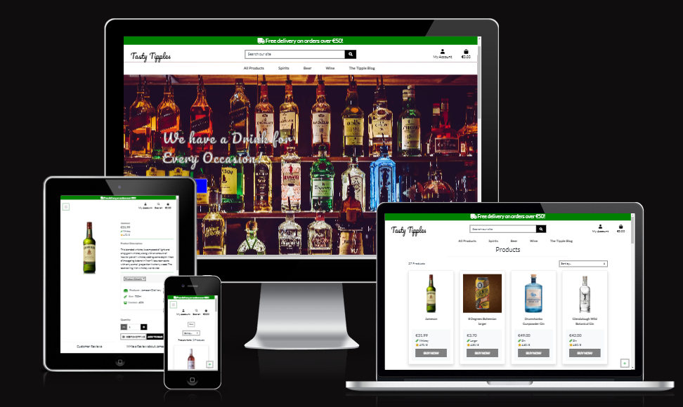


# Aim of Website

The goal of this website is to become Ireland number one Online Drinks Store. To provide a platform so users can find and buy products produced in Ireland by Irish Distilleries and Craft Brewers. We also want to be the go to website to get unique Spirits, Wines & Beers that currently cannot be easily got by customers in the Irish Market. This ecommerce platform will also aim to be a hub for educating people about products, distillers, brewers and provide honest reviews so customers can make an informed purchase.

# Target Audience

 The alcohol e-commerce market is expected to surge to over 42 billion by 2025 as outlined in [Forbes](https://www.forbes.com/sites/katedingwall/2021/12/22/alcohol-e-commerce-expected-to-reach-42-billion-by-2025/) recent article. Tasty Tipples is perfectly placed to take advantage of this surging market. Our Target market currently is male and female aged between 25 to 50 located in Ireland. Once the shop is established, we will be aiming our sights on high value clients on the world market with our high-end spirits made in Ireland.

#  User Experience (UX) 

## User Stories

### First Time Visitors Aims:
  - As a first-time visitor, I want to quickly and easily understand what this website is about and what it can do for me.
  - As a first-time visitor, I want to be able to easily navigate around the site.
  - As a first-time visitor, I want to be able to register and create an account to get full access to the site.
  - As a first-time visitor, I want to quickly view a summary of all products available.
  - As a first-time visitor, I want to click on a product and view the product details.
  - As a first-time visitor, I would like to learn more about the site owners.

### Customer Aims:
  - As a customer, I want to be able to quickly search the site to see if they have the product I am looking for.
  - As a customer, I want to see this is a reputable website and that my payment will be secure.
  - As a customer, I want to be able to enter my payments details to pay for my order.
  - As a customer, I want to be able to add multiple products to a shopping bag and see a total.
  - As a customer, I want to be able to view my shopping bag and be able to edit it before checkout.
  - As a customer, I want to be able to contact the store owner if I have any questions.
  - As a customer, I want to be able to see reviews on products from other customers.
  - As a customer, I would like to get an email confirmation of my order to confirm my order was successful.
 

#### Returning Visitors Aims (registered user):
  - As a returning visitor, I would like to be able to quickly log in and log out of my account.
  - As a returning visitor, I would like to be able to view my profile and my order history.
  - As a returning visitor, I would like to be able to leave a review on the product I purchased.
  - As a returning visitor, I would like to find links to their social media channels and follow them.
  - As a returning visitor, I would like sign up to a newsletter to find out about any special offers or new products.
  - As a returning visitor, I would like to learn & be educated more about products and manufactures from their blog.
 
### Admin / Store Owner Aims:
  - As a store owner, I want to be able to create, edit update or delete a product.
  - As a store owner, I want to be able to login to the admin panel of the site.
  - As a store owner, I want to be able to change user permission on the site and delete users if necessary.
  - As a store owner, I want to be able to add, edit or delete a blog post.
  - As a store owner, I want to be able to delete any inappropriate reviews.
  - As a store owner, I want to be able to view order details from customer’s so I can process orders.
  - As a store owner, I want to be able to market my website online to drive traffic to my site.

   
#  Agile Approach to Project Devlopment 

An agile approach was taken in the development of this project. The project was dissected into smaller parts and an iterative approach to project management and development will be used to achieve faster development of the project and optimise time usage.

- MoSoCoW Method:
  - I will also aim to integrate the MoSoCoW Method in to this project. Which is a four-step approach to prioritizing which project requirements need to be carried out first in order to achieve project goals and criteria of user stories. Custom labels will be created in GitHub and allocated to each requirement so they can be easily filtered and identified.
  - 
- User Stories
  - The whole project was broken down in 30 individual user stories, each user story was a self-contained development mini project that helped reach the overall goal of the website. They were entered into GitHub as GitHub issues.
  - [View List of 30 User Stories](https://github.com/wlillisdev/tasty_tipples/issues?page=1&q=is%3Aissue+is%3Aclosed)
  - Specific acceptance criteria was allocated for each user story and a list of tasks were also established. Each task would need to be completed to ensure acceptance criteria is met. See example below.
  - 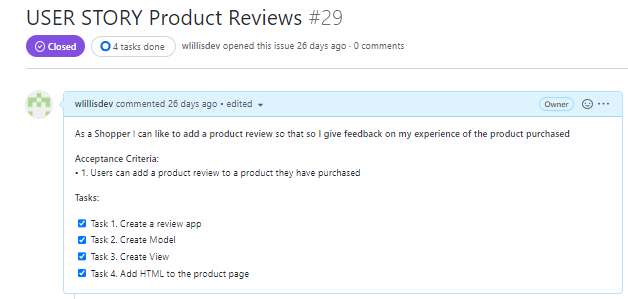
  - The Moscow method was then applied to each user story. And tags were applied to prioritise the order of work.
  - [Example of MOSCOW tags](assets/readme/moscow_tags.png)
  - The user’s stories were then put into Tasty Tipples Iteration 1 for website launch. These users stories were deemed essential for the initial launch of the website.
  - [View Project Iterations](https://github.com/wlillisdev/tasty_tipples/milestones)
  - A Kanban board was set up in GitHub in order to manage the various project user stories. It was divided into 3 main areas to track the progress of user stories. The 3 Columns were To Do, In Progress and Done.
  -[View Kanban Board](https://github.com/users/wlillisdev/projects/3/views/1)
 
#  Features 


 [View Homepage Features](https://tasty-tipples.herokuapp.com/)

## Favicon
 - As it is an online drink store, I used a alchol related icon. A champagne bottle opening it is eye catching and fun and also ties in with the websites primary colour green. The Favicon was got from [favicon.io](https://favicon.io/)

  


## Navigation Bar
 
  - The Navigation bar is located at the top of all Pages. It is simple but clean design. It includes the logo, Main Products Links, search bar, My Account and a Shopping Bag.
  - If a user has logged it, they can view their profile via the account link.
  - Notification Banner, is located on top of the nav and displays important information.
  - The nav design will allow a visitor to quickly and easily get around the site as each link logically leads to the next.
  - The nav elements of the main products has a hover underline transition effect that is generated when hovered over which adds to the user experience.
  - The nav bar is responsive and collapse’s in to hamburger menu when on smaller screens.


  </br>   

  - The nav bar below shows user logged in view.
  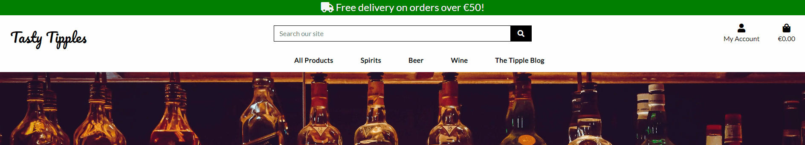

  </br>

  - The responsive nav bar below.
  
  - 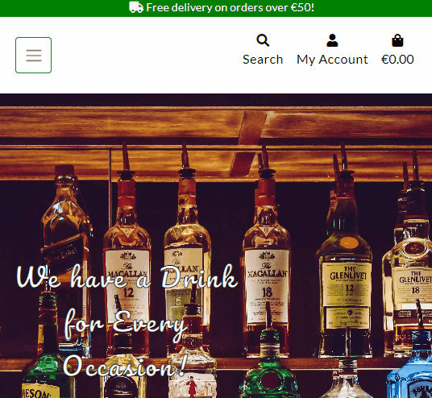
 
## Landing Page

  - The landing page contains an eye-catching background image of lots of bright bottles of spirits and immediately catches the user’s attention.
  - The text on the screen clearly tells the user what’s the site is about and what the user needs to do next. They are encouraged to click the Shop Now button.
  - Hero image displayed below
  - 

## Welcome Section

- If the users scrolls down from the hero image, looking for more information. They will come across the welcome section.
- It provides the user with a brief statement about who we are and what we can do for the user.
- A product carousel with three eye catching product images helps to keep the user engaged and displays important product information.
- It also gives the user an opportunity to sign up to our newsletter.
- It also gives the site owner the opportunity to optimise the text with important onsite SEO keywords.

<br>

- 

## Popular Products

- This section invites the user to click on some of our popular products. It gives the user a brief description of each product to get their attention it also has an eye-catching image. It helps on the user’s journey and allows an easy path to what the user is looking for.
- It also allows the site owner the opportunity to insert important SEO keywords.
- The boxes have a hover effect so when the user hovers over the image the box is raised. It helps with user experience and user retention on site.

<br>

- 

## Customer Testimonials

- This section was designed to build confidence with new site visitors, new visitors can see real client Testimonial’s so a potential new customer can have confidence that we are a trusted and reputable ecommerce site.
- The boxes have a hover effect so when the user hovers over the image the box is raised. It helps with user experience and users retention on site.

- 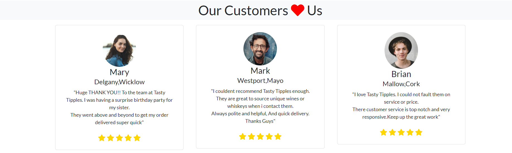


## Footer

  - The footer is simple and clean design it is the same on all pages of the website.
  - It can be broken down into 4 main columns, social media, Shop, Company Details & newsletter.
  - Social Media column - Contains links to our 4 main social channels, icons have a hover effect. Also, to instil user confidence a link to our trust pilot page is also included.
  - Shop column - Contains links to Login and all our main product category pages.
  - Company Details column - Contains links Blog, About Us, Privacy Policy, Terms of Service and Contact Us page
  - Newsletter column - Contains a form to allow the user to sign up to our newsletter.
  - The main aim of the footer is to increase engagement with visitors and allow easy navigation and links to important information. With the goal of getting the user to subscribe to the social channels & newsletter.

 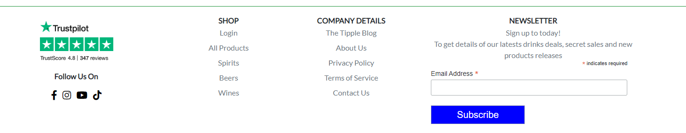

## Scroll Back to Top
  - When the user scrolls below the fold on certain pages in the bottom right of the screen there is an arrow. When the user clicks on it, the user will be returned to the top of the screen. And the icon will be hidden. This feature will improve user experience.

 
## About Us

  - The about us section is a very brief description about Tasty Tipples to quickly give the user more information about the business and why the business was started.
  - It highlights the goals of the Business so the user can understand and build trust with the brand.
  
  - 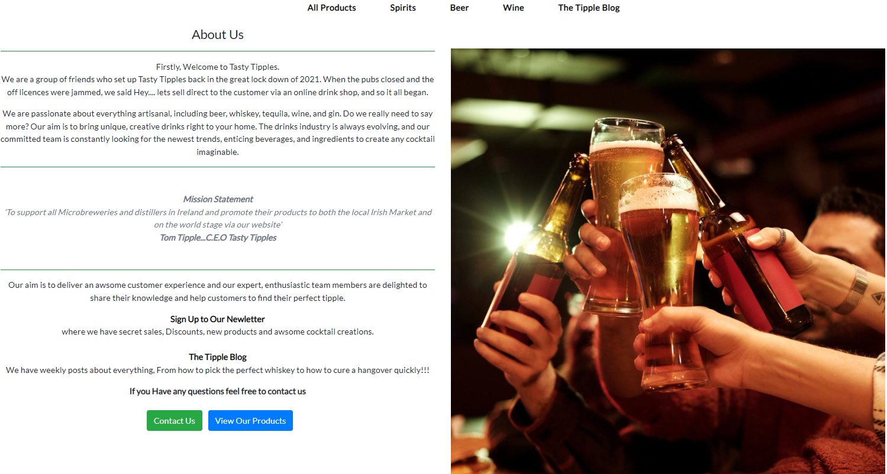

  <br>

  - It also provides links to important external resources for anyone suffering with alcohol problems.

<br>

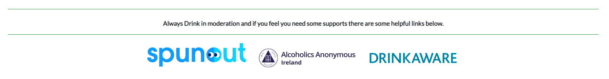


## Contact Us

  - The contact information for Tasty Tipples is visible to the user, including their address, phone number.
  - The user is asked for their contact information and a brief message about their inquiry
  - All fields are required for the message to be sent, user will be given feedback if any errors occur.

  - 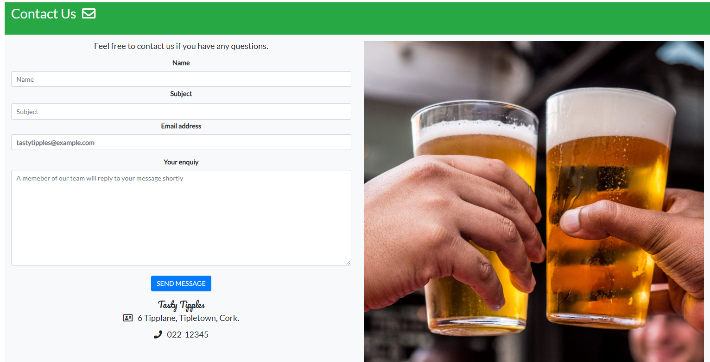
  - The user will get an alert if the message was successfully submitted.

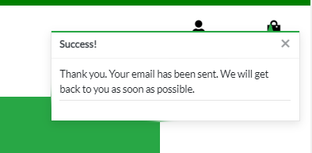

  - The site owner can view the contact us inquiry from the admin page under the contact us app.

  - 
 

## All Products Page

  - When the user clicks on all products every product on the site will be displayed on one page. They are displayed in a card format and the layout depends on the device used.
  - The cards have a hover effect that cause the cards to be raised if hooved over.
  - Each card displays information in relation to product name, price, rating and category.
 
 <br>

  - 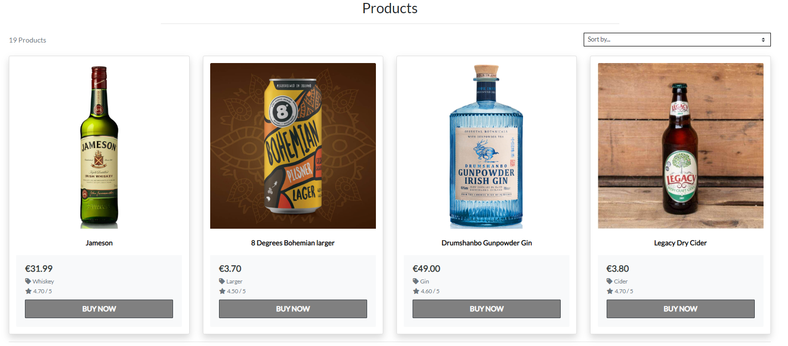
  
  <br>

  - The user also has the ability to apply various filters to sort product via specific criteria.
 
 <br>

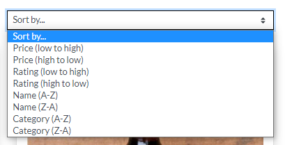

<br>


  


## Product Detail Page

  - This page displays important information about the product. It shows Name, Category, Review score and product description on the top part of the card.
  - Product details give the user more information to the buyer in relation to the producer, size and alcohol content. It is also a collapsible accordion menu.
  - The user has the ability to type in a specific quantity or use the + or - buttons.
  - The user adds the product to the shopping bag if they would like to buy the product.
  - When the Admin is logged in the edit and delete buttons will only appear to give the admin CRUD capabilities for the product.

  <br>

  - 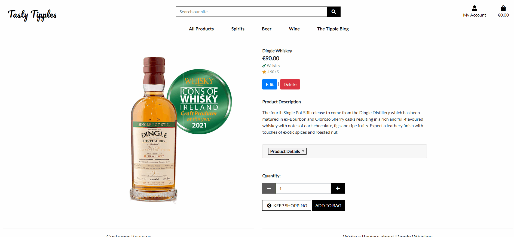


## Reviews
- Add Review
  - Only registered users can add a product review.
  - If user is registered a form will be visible, they will have the ability to pick a score out 1 to 5 stars. And write a brief review on the product.
  - The edit and delete buttons are only visible on the review to the user profile who created the review.
  - 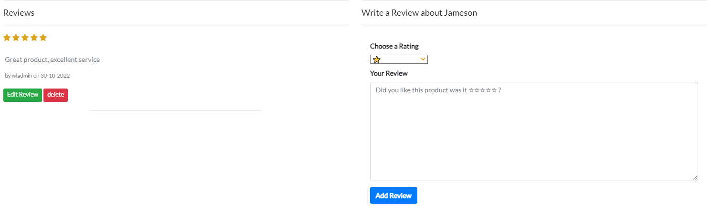
 
 <br>

- Update Review
  - The user has to ability to update a previous review.
  - 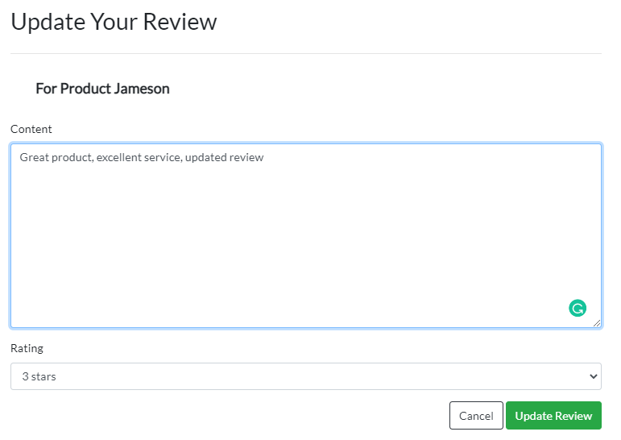
   
<br>

  - 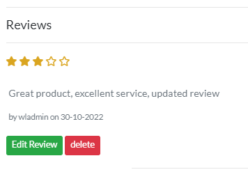

<br>


- Delete Review
  - The user can also delete a review they have made, when the delete button is pressed a modal pops up on screen and asks are they sure if they want to delete this review.
  -	The review will be removed from  the website if delete is clicked by the user and a notification alert displayed.

  <br>

  - 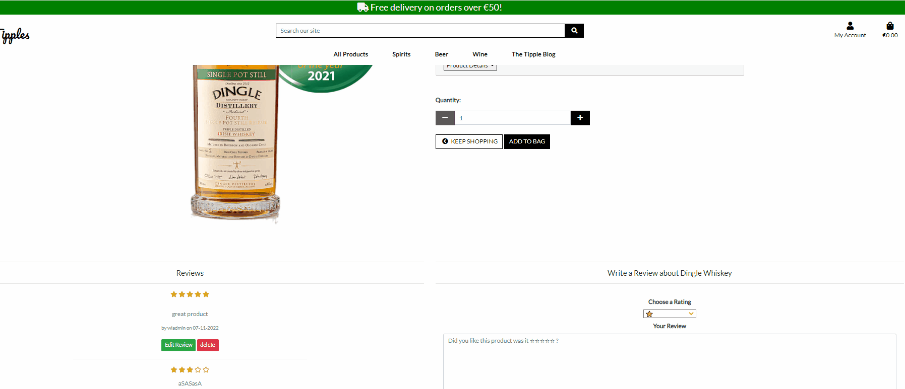
 
 <br>


## Product Management
 
- Add Product
  - The add product page is located in the account dropdown menu, under product management. It is only accessible by super users.

  - 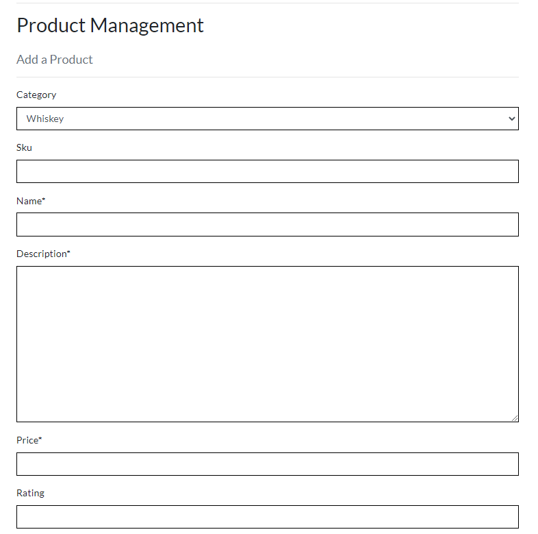
  
  <br>
  
  - The form lists all the fields that will be required to create a new product.

- Edit Product
  - The Edit product page can only be accessed by super users.
  - The Edit Product page can be accessed by clicking on the edit button on the product detail page.
  - This page will load all the details of the existing product, giving the admin the option to edit any fields and update the information.

- Delete Product
  - The Delete product page can only be accessed by super users.
  - The delete Product page can be accessed by clicking on the delete button on the product detail page.
  - When clicked a modal will appear asking if you really want to delete this product.
  - 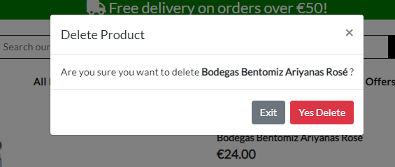

## Shopping Bag
- The user can add products to the shopping bag as they are shopping, the shopping bag icon in the nav will give the user a running total of goods in the bag.
- On the shopping bag page the shopper can see what products are currently in the bag, and has the option to edit quantity of products or remove the product.Before they head to the checkout page.
- 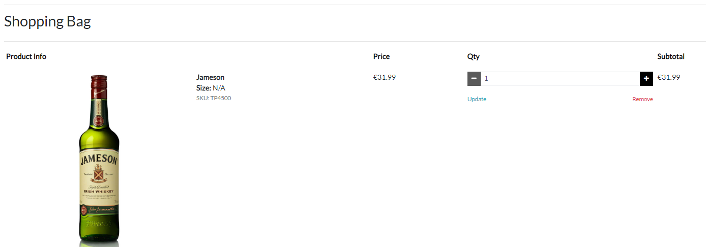

<br>

## Checkout
- Here the shopper fills out his or her contact details, delivery address, and card number.
- If the user is signed in and has save delivery information box ticked it will be saved it to their profile, the delivery details and email address will be automatically filled in the next time they make a purchase.


- 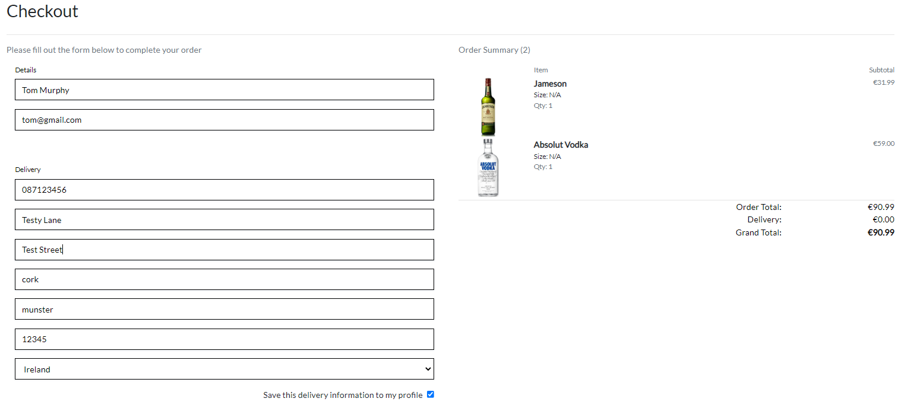

- The order summary will also appear to the right.

<br>


## Payment
- Payment is made via Stripe payments.
- The site can be tested by using the dummy card number 4242 4242 4242 4242 with the expiry date 04/24 and the CVC code 242.
- An image saying secure payments was added with an external link to stripe if customers want to find out more about stripe payments.
- 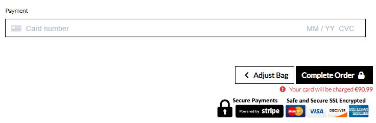

<br>

- A loading spinner page appears. if payment is successful, you will be redirected to a Thank You page, with details of your order and alert saying order successfully processed.
- 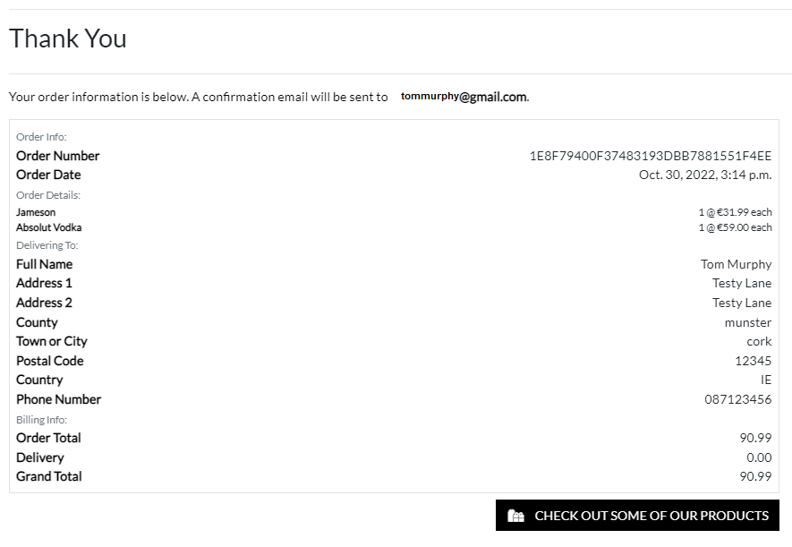


## Checkout Process

<br>

- 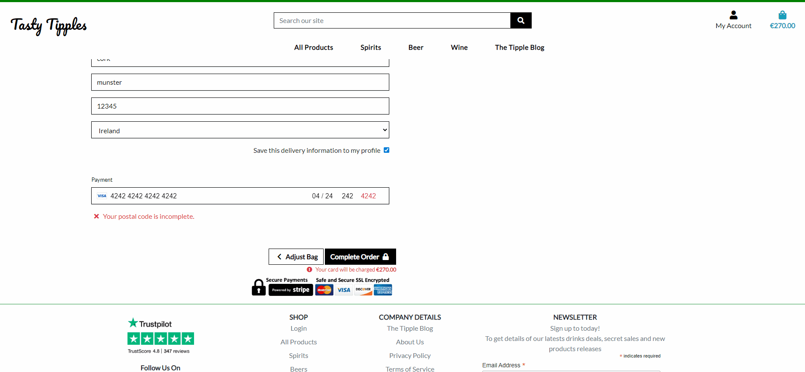

## Confirmation Email
- If the order is successful a confirmation email will be sent to customer.

- 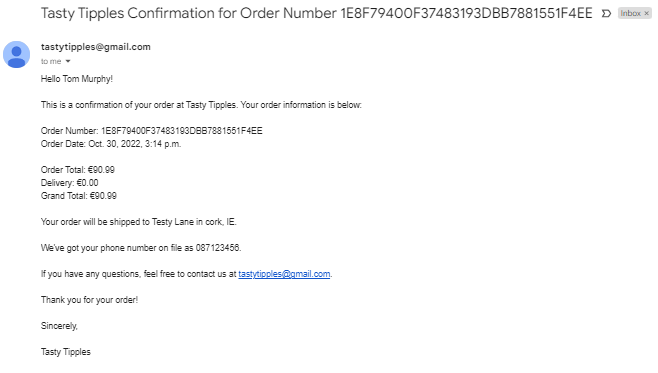


## Webhooks
- Using the Stripe settings, webhooks have been set up to confirm an order goes through after payment.
- 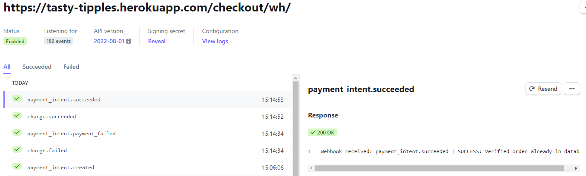

## Profile Page
- When a User registers for a new account, a profile page will automatically be created for them. The link to their profile page appears under the Account icon in the navigation bar once they are logged in. On this page the user can choose to update their profile information 
- The Profile page also contains a table listing out the details of all the users past purchases. 
- The user can update information on their profile if they require.
- 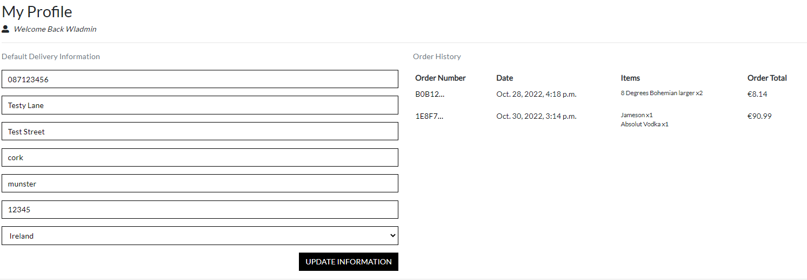


## Register, Sign In & Log Out of Account
- Sign Up
  - When a new user clicks on register, they will be brought to the sign-up page.
  - After submitting the form, The User are then emailed a verification link to confirm their details and finalise the setup of their new account.
  - 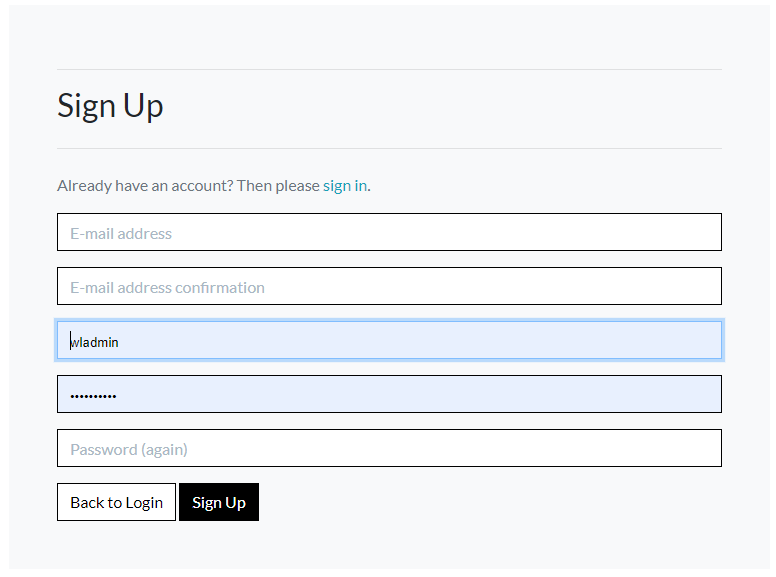

- Sign In
  - The login page is used to log in users with an existing account.
  - A Forgot Password link is also present that allows users to recover their password if required.
  - 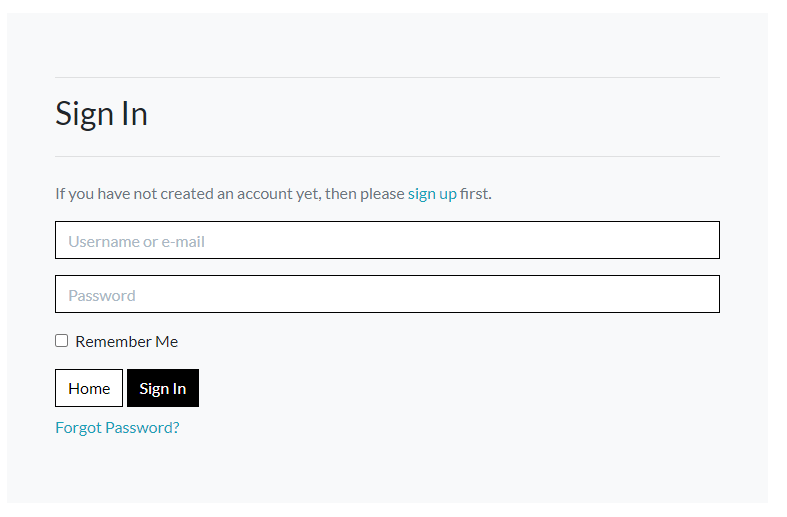

- Log Out
  - The logout page allows the user to sign out of their account.
  - It also displays the users name
  - 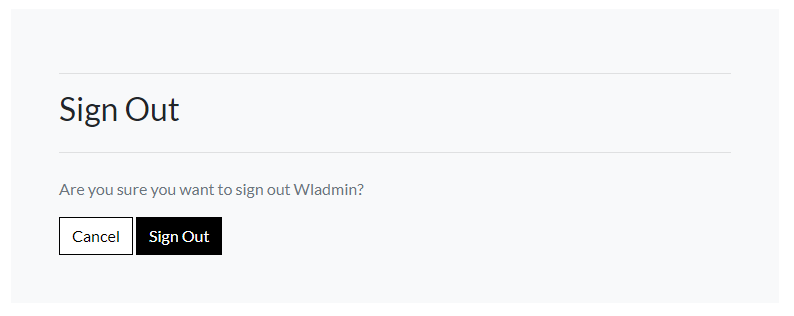


## Error Pages
- Custom error pages were created and set up,
 - Error Pages Created
    - 400 Bad Request  
    - 403 Page Forbidden 
    - 404 Page Not Found 
    - 500 Server Error 

  ## Newsletter
- Mail Chimp has been integrated into this site via the newsletter sign up form in the footer. Mail chimp will allow us the effectively collect users emails and run email marketing campaigns.
- Users will get feedback if their email was successfully submitted.
- 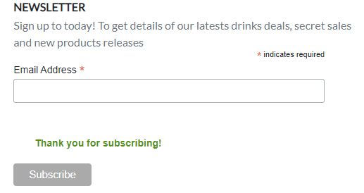
- Mail Chimp interface shows how many subscribers we currently have from the newsletter sign up form.
- 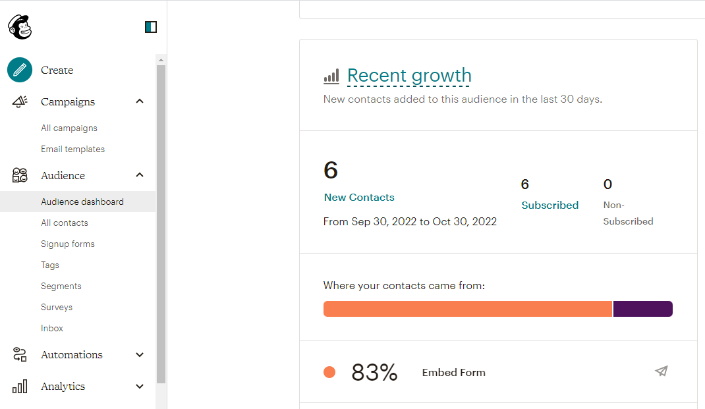


## Message and Alerts to site Users
- In the top right-hand corner of the screen a box will pop up informing the user of any actions they have performed.
- Different alerts will have different colours for example a success alert is green and an error alert is red.

- 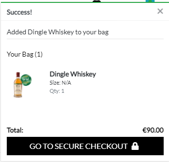
- 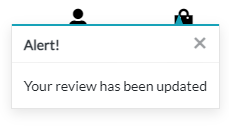

<b>

- When the Shopper spends over €50 they will get a message  you got free delivery.

<br>

- 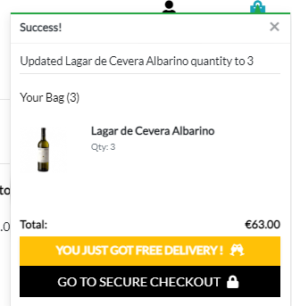

## Blog
- Tasty Tipples has a blog for content marketing, The initial page has a list of blog posts, that contains a Title and a snippet of what the article is about.
- 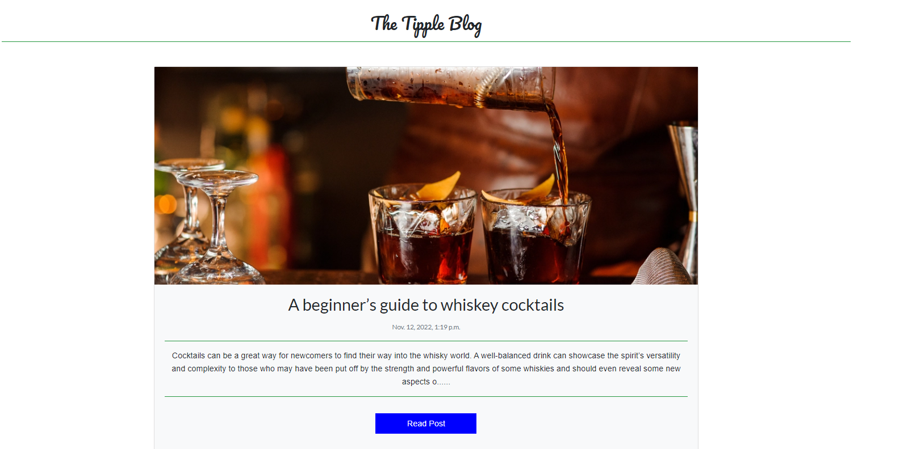 
- The blog posts will be paginated after 3 posts. Paginated pages can be found at the bottom blog post list.
- Once the user clicks on a blog post to read, they will be brought to a blog detail page. This will contain all the articles information.
- 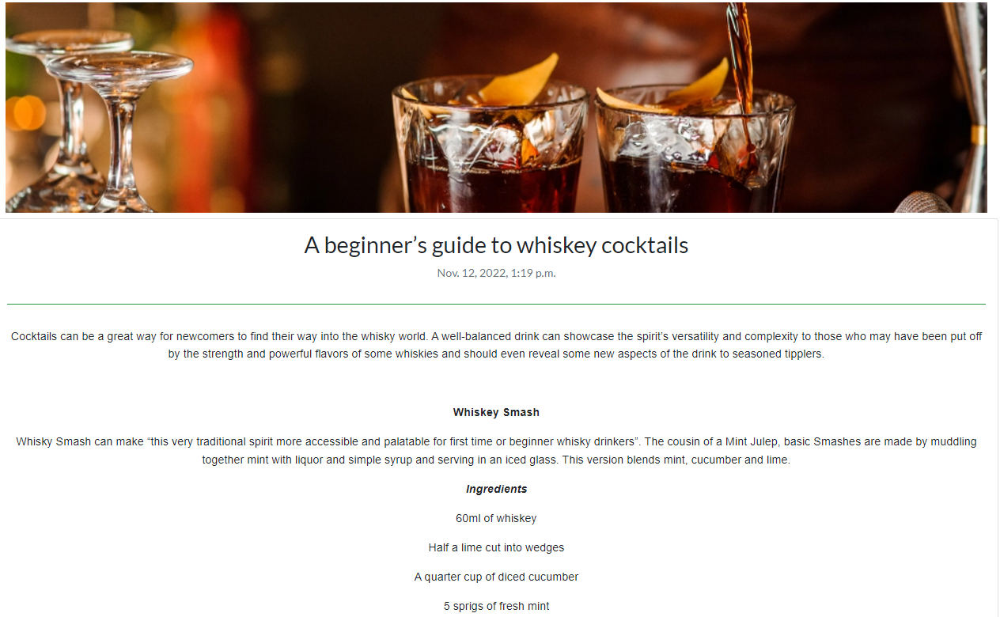 
- Currently blog posts can only be added from the admin panel. Summer note has also been set up to format blog post by the admin.

<br>

- 


## Admin Panel
- On the Admin Panel and as an admin/superuser they have full CRUD functionality. For all apps on the admin panel.
- They can also quickly view and inspect recent orders.
- 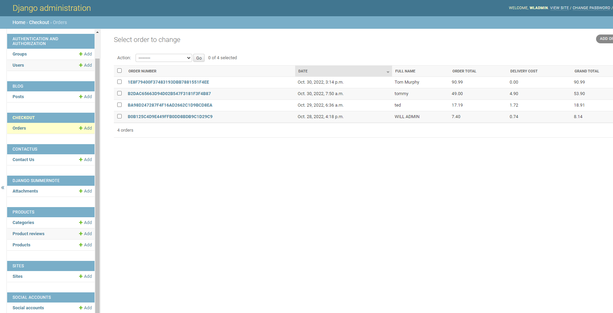

<br>

#  Design 

 - Theme
   - The Theme of the website was to build a bright and engaging ecommerce site. The styling was kept to the minimum as we didn’t want to take away from the product images. And wanted the customer to focus 100% on the products.
   - Fonts were imported from google fonts, Pacifico for the logo & Lato were chosen for general text.

 - Data Model
   - Lucid Charts was used to design and visualise the models used in this project.

    - 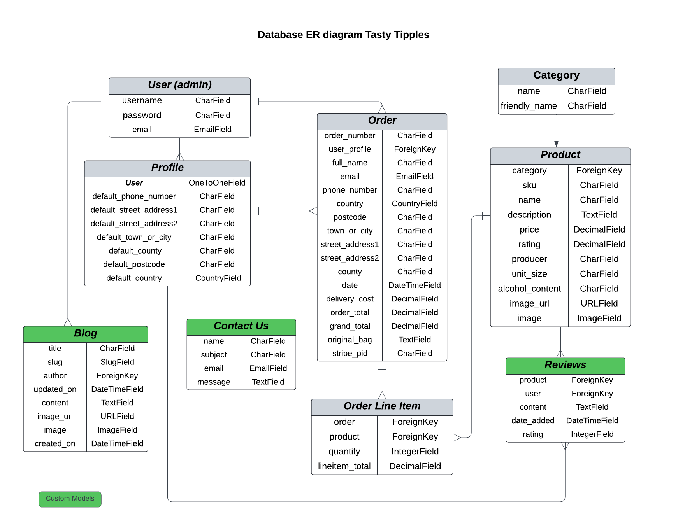
    - Green refers to custom models

 - Colour Palette
   - The colour palette is made up of Three main colours. Although simple they create a good contrast with each other and helps support the overall theme. The Blue was used mainly for buttons and the green for a hover effect on buttons.

 


- Imagery
   - The images that were selected for the website were bold and bright and conveyed fun and enjoyment. products were kept with white background where possible to highlight them more.

- Wireframes
  - To create the initial layout and wireframe I used Balsamiq. This helped fine tune the design and layout. It also helped in calculating the amount of content and images required. 
  (Home Page Wire Frame Below)


  -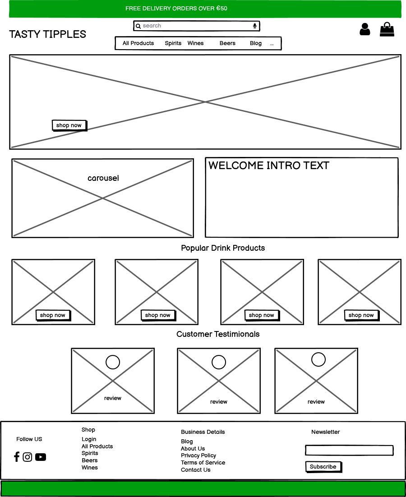

  <details><summary>Mobile Home Page Wireframe Concept</summary>
 
  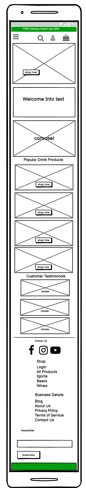
  </details>

  <details><summary>Desktop All Products Page Wireframe Concept</summary>
 
  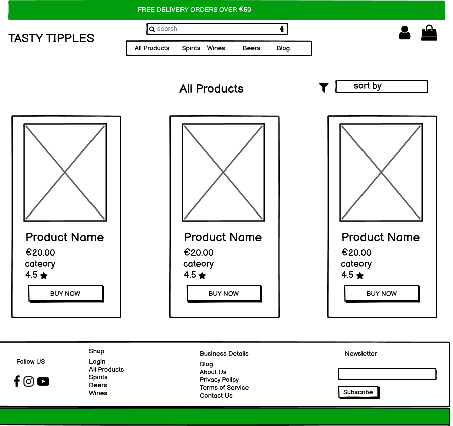
  </details>

  <details><summary>Mobile All Products Page Wireframe Concept</summary>
 
  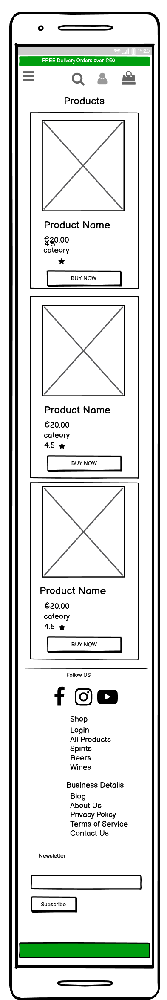
  </details>

  <details><summary>Desktop Product Detail Wireframe Concept</summary>
 
  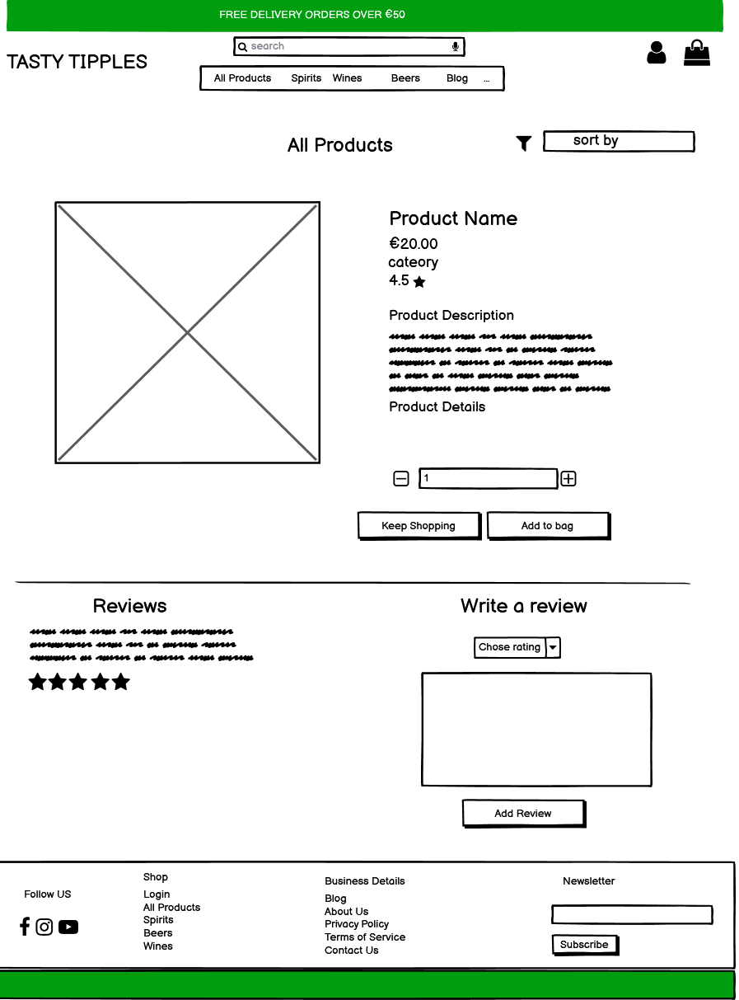
  </details>

  <details><summary>Mobile Product Detail Page Wireframe Concept</summary>
 
  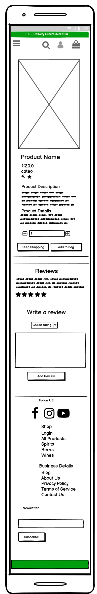
  </details>

  <details><summary>Desktop Blog Posts Wireframe Concept</summary>
 
  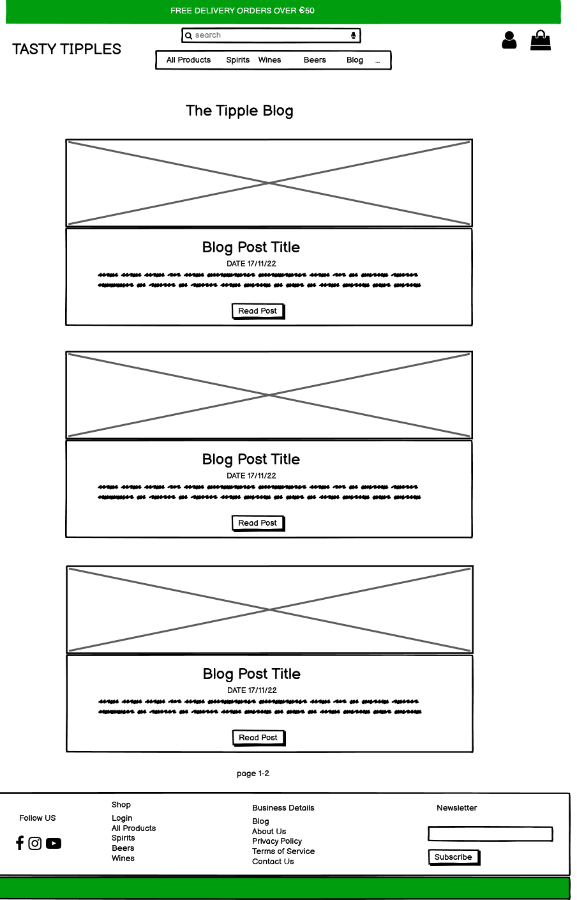
  </details>

  <details><summary>Mobile Blog Posts Wireframe Concept</summary>
 
  
  </details>

  <details><summary>Desktop Contact Us Wireframe Concept</summary>
 
  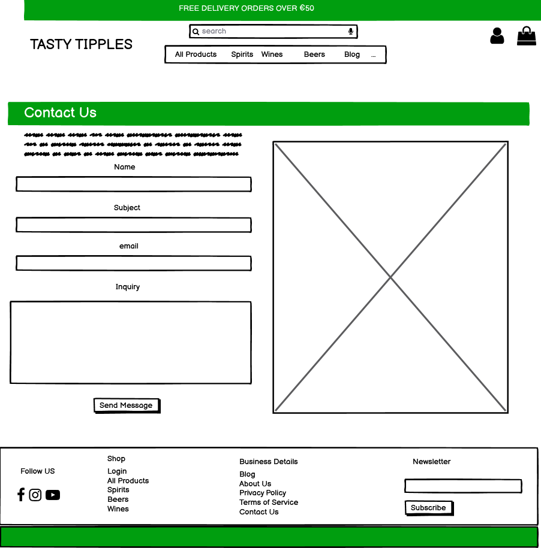
  </details>

  <details><summary>Mobile Contact Us Wireframe Concept</summary>
 
  
  </details>  

<br>
   
#  Future Development 

- Wish List
  - The user will be able to select products they like and add them to a wish list that will be stored in their profile page.
 
- Blog 
  - When I have time add full CRUD capabilities to the blog from the front end for the admin. And add comments section to the blog post detail.
 
- Sign Up & Log in with social media
  - Allow the user to quickly register a new account or log in via a social media profile.

- Age Verification
  - A modal to pop up on the home screen so the user needs to verify age before they can enter the site.


#   Web Marketing

## Target Audience
 Tasty Tipples is a Business to Customer business model. Our Target market currently is male and female aged between 25 to 50 located in Ireland. Once the shop is established, we will be aiming our sights on high value clients on the world market with our high-end spirits made in Ireland


## Marketing Mix
  We have decided to adopt a multi prong approach to launch Tasty Tipples. A mixture of paid and organic methods will be adopted to get quick and consistent traffic and sales to the new website. The staff are already proficient in all elements of social media. They will manage this internally; they will leverage content creation and short form video content to gain brand awareness and drive traffic to the site. Due to lack of knowledge and time some services will be outsourced such as paid marketing, email marketing and SEO. With this multi-channel approach, it will drive short-, medium- and long-term growth for Tasty Tipples.


## Social Media
- Facebook, Instagram, YouTube, TikTok
  - Our social channels are how we aim to build our brand awareness and drive organic traffic initially to our website.
  - We will aim to create short snappy fun video content and leverage the growing trends of TikTok, YouTube Shorts & reels to grown our followers and drive traffic quickly. With the aim of getting our content viral.

<br>

### Facebook Page


[Visit Facebook page](https://www.facebook.com/profile.php?id=100087413854348)


## SEO (Search Engine Optimisation)
- Keyword Research
  - A number of tools were used to compile a list of keywords and analyse keywords to see the search volume, difficulty & buyers intent.
  - [Googles Keyword planner](assets/readme/google_planner_ireland.png)
  - [Wordtracker.com](assets/readme/whiskey_keywords.png)
  - [And the related searches section at the bottom of a google search page](assets/readme/related_searches.png)
  - A list of keywords was selected to represent the buyer’s journey. A mixture of long tail and short tail Keywords with low to high keyword competitiveness were picked.
  - 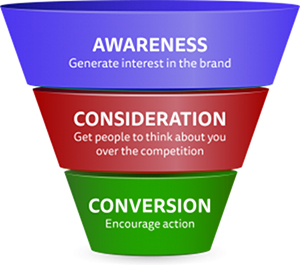
  - Onsite SEO will be carried out to optimise product pages & alt tags. Due to time constraints, it will not be completed in this iteration of the project.
  - Long-term off-site SEO link building campaigns will also be used to grow organic search traffic. This will be completed in future iterations of the project.


## Content Marketing

- The Tipple Blog
  - Our blog will be used to target SEO keywords and answer questions that people are actively searching for answers to online. This will not only educate our shoppers but it also helps build confidence and trust in our brand. While at the same time ranking the website in search results for more keywords.

- Short Form Content 
  - With a huge shift on all social channels to short form video content we still actively release short videos on a daily basis to leverage this trend. Software like [repurpose.io](https://repurpose.io/) will be used to post content across all channels at the same time to improve productivity and get maximum exposure.


## Paid
- As this is a brand-new website it will take time to generate organic traffic from search engines. For the first 6 months we will actively be using and testing paid ads to drive traffic and conversions.
- Google PPC
  - We will actively run google ads especially targeting our high-ticket products.
- Facebook, TikTok, YouTube
  - We will run ad campaigns on these channels mainly focused on brand awareness and building an online presence. We won’t directly market drink products on these channels. But adopt a playful and fun approach to engage with users.


## Email Marketing
- Email marketing when done correctly has low input costs and allows us to target our customers with a more customised offering giving a Better ROI.
- Mail Chimp
  - We will initially build a subscriber list to our newsletter via the form in the footer of our website.
  - We will also send weekly newsletters about our latest’s drinks deals, secret sales and new products releases.


## Outsourcing
- The intention is to outsource all paid marketing to a digital agency & also get them to monitor and update our keywords for SEO & build backlinks on a periodic basis. The agency will also take care of the email marketing campaigns. The rest will be done in-house by the staff of Tasty Tipples.


## Sitemap.xml
- A sitemap file with a list of all the important URLs were created to allow search engines to quickly crawl the website and index its pages. This was made using [XML-sitemaps](https://www.xml-sitemaps.com/) This can then be submitted to google search console and Bing webmaster tools to allow the quick and fast indexing of Tasty Tipples in search engines.


## Robots.txt
- A robots.txt file was created to tell search engines the website pages not to visit or index.


# Testing 

### Validator Testing 

 - HTML Validator
   - [W3C](https://validator.w3.org/) site was used to validate the **HTML** code.
   - A number of errors were initially flagged up and were fixed.
     
 ### All Pages are now error free see links below:

 
   - [Link to Homepage Test Passed](https://validator.w3.org/nu/?doc=https%3A%2F%2Ftasty-tipples.herokuapp.com%2F)
   - [Link to all products passsed](https://validator.w3.org/nu/?doc=https%3A%2F%2Ftasty-tipples.herokuapp.com%2Fproducts%2F)
   - [Link to product detail](https://validator.w3.org/nu/?showsource=yes&doc=https%3A%2F%2Ftasty-tipples.herokuapp.com%2Fproducts%2F2%2F#l426c6)
   - [Link to all Contact Us passed](https://validator.w3.org/nu/?showsource=yes&doc=https%3A%2F%2Ftasty-tipples.herokuapp.com%2Fcontactus%2F#l282c107) 
   - [Link to About Us passed](https://validator.w3.org/nu/?showsource=yes&doc=https%3A%2F%2Ftasty-tipples.herokuapp.com%2Fabout%2F#l282c107)
   - [Link to Terms of Service passed](https://validator.w3.org/nu/?showsource=yes&doc=https%3A%2F%2Ftasty-tipples.herokuapp.com%2Fterms%2F#l282c107) 
   - [Link to Privacy Policy passed](https://validator.w3.org/nu/?showsource=yes&doc=https%3A%2F%2Ftasty-tipples.herokuapp.com%2Fprivacy%2F#l282c107)
   - [Link to Add Product passed](https://validator.w3.org/nu/?showsource=yes&doc=https%3A%2F%2Ftasty-tipples.herokuapp.com%2Fproducts%2Fadd%2F#l290c60)
   - [Link to Edit Product passed](https://validator.w3.org/nu/?showsource=yes&doc=https%3A%2F%2Ftasty-tipples.herokuapp.com%2Fproducts%2Fedit%2F20%2F#l290c60)  
  

## CSS Validator
  - The [W3C](https://validator.w3.org/) was used to validate the **CSS** code
  - The website had a few [errors](assets/readme/css_errors_1.png) initially but were fixed.
  - The website passed with no errors


  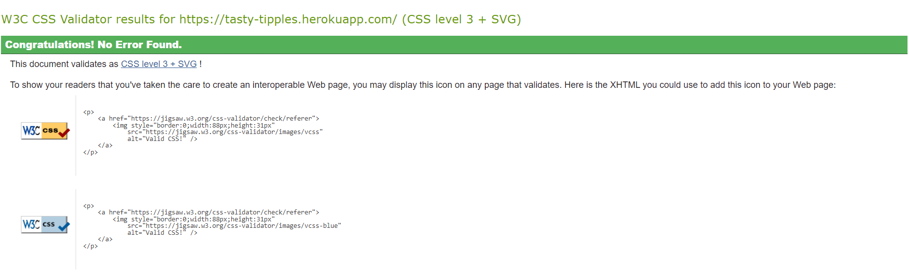

  ## Python
  - Python code was tested to ensure that it met PEP8 style guidelines. This was done within the terminal console using the command python3 -m flake8, which displayed errors and warnings within the code. Files were gone through a fixed individually the majority were in relation to exceeding the number of characters per line.
  - [Errors fixed in Checkout App](assets/readme/python_error.png)
  - [Errors fixed in Products App](assets/readme/product_error_py.png)


  ## Java Script
  - [some errors found during testing](assets/readme/errors_js.png)
  - All errors were fixed. And now passed ok through [JSHint](https://jshint.com/)

  
 
## Lighthouse
 - Lighthouse testing was carried out in Developer Tools in Chrome. Initially it gave a number of improvements and flagged up a number of images that needed to be reduced in size. Which was done.
 - [See Light House Before Improvements](media/light_house_first.png)
 - The results were also skewed as the chrome extensions on my testing device was affecting the lighthouse results. The tests were redone in incognito window and performance score increased. Results below from home page
 - As the homepage has a lot of imagery to allow for an engaging landing page. I was unable to improve lighthouse results further. With more time I would like to tackle other errors outlined on the lighthouse report.
 - Desktop Result’s
 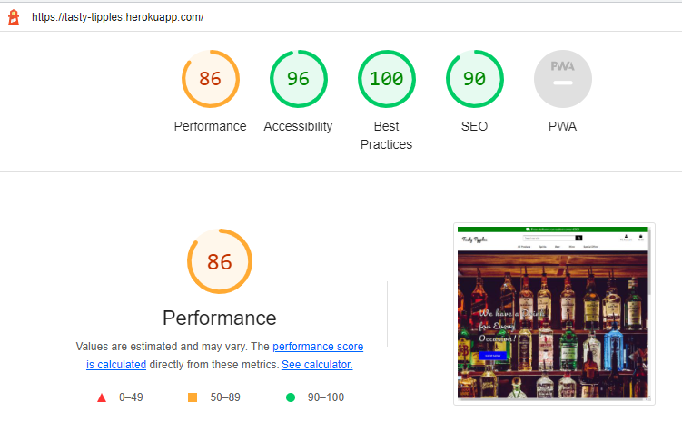


 
## Manual Testing
  - All the site links were manually tested to see if they all worked ok and linked to the correct locations.
  - The site was further tested using feedback from my mentor, family and friends who checked it on different devices they had.
  - All of the page's features were tested on Google Chrome, Microsoft Edge, Mozilla Firefox, Safari, and Opera.
  - Google Chrome's Developer Tool was used to inspect page elements during the build and helped identify and debug issues within the HTML and CSS.
  - The README.md was checked before final submission and links verified.

  ## Manual Feature Testing 
  - A structured approach was taken to go through all of the sites  features to see it they worked properly. 
  
  | Feature Tested | Testing Method | Final Result |  
| --- | --- | --- |
| User Register account | Each mandatory fields were left blank intentionally to check if error messages appeared if form submitted blank | Pass | 
| User Register account - Invalid Email Field | An invalid email address was tested to ensure error message appeared | Pass | 
| User login to account - Blank Fields | All fields were left blank to ensure an error message was displayed to the user | Pass |
| New User Confirmation email - to verify details | tested with a temporary email, signed up for a new account, confirmation email sent from website so user can verify details | Pass |
| User recover password - forgot login password | At login screen, forgot password was clicked, at password reset screen, previously registered email entered, reset email was sent and password was reset | Pass |
| User login to account - wrong password | Incorrect user password was intentionally used with wrong spelling and upper- and lower-case letters and numbers were tested to ensure an error message was displayed to the user | Pass |
| Non registered user - can not a add a review | As an unregistered user there is not option in product detail page to leave a review | Pass |
| User Logged In - can add a product review | Logged in as registered user. Add a review form appears on at the bottom of product detail page, rating for product selected and review written. Add review clicked, review saved to reviews section | Pass |       
| Update a previous product review - user logged in | Logged in user clicked update on previous review they wrote, user brought to update review page, both text of review and star rating edited, and update review clicked and new review updated and stored, Toast update also displayed | Pass |
| Delete a product review - user logged in | User clicks on delete review they have previously wrote, Modal pops up, With warning, Click delete, review deleted from website, Toast delete review alert appears | Pass |
| Delete or Update review - that you did not create | manually enter a URL for delete/update review on a review that was not created by the user, redirected to error page | Pass | 
| Admin Create a blog post - No Featured Image | Blog post was added with no featured image from admin. A placeholder image was added by default    | Pass
| Admin Create a blog post - Unique Title | A blog post with the same title as an existing post was created, error message displayed appeared saying unique title required | Pass | 
| Admin Update a blog post - edit old post | In the admin panel changes made to previous blog post and checked to see if they were updated on the front end | Pass 
| Admin delete a blog post - remove old blog post | In the admin panel click on old blog post click on delete and confirm delete, post successfully removed | Pass
| Contact Us form | various mandatory fields were left blank and the form was submitted; alert messages appear to user if field was left blank | Pass 
| Contact Us alert | all fields were filled out on the form and submitted, alert message appeared, form submitted successfully | Pass
| Contact Us Admin | the admin panel contact us app, was checked to see if the inquiry had been successfully saved in the database | Pass         
| Social Media Icons - Links in Footer | All social media icons links clicked, all opened in new screens and to the correct channel | Pass |
| Footer - Shop & Company Details | All links in the footer were clicked and checked to be working and directed to the correct pages | Pass |
| Newsletter - Subscribe to newsletter | A valid email was entered into the form, and submitted. A message thank you for subscribing appeared, Email checked in mail chimp to confirm it was added ok | Pass |
| Search - user can search for products | Keywords of products and categories were entered in search bar, this returned products that were searched. Also, products that are not on site were also searched, it returned a message No Products found. | Pass |
| Sort Products | All options of the sort by drop down tab were tested, to confirm they filtered the products correctly | Pass |  
| Shopping Bag - adding a product | From the product detail page add to bag was clicked, item was added to bag. Toast success displayed item added to bag | Pass |
| Update Shopping Bag | The + & - icons were used to adjust qty of items. Then update was clicked, the grand total was updated. The quantity was typed in and update clicked, grand total updated. The remove link clicked, removed the item from the bag, Toasts alerts worked for update and delete bag page | Pass |
| Stripe - incorrect card number | entered an invalid 16-digit card number, got error message your card number is incomplete | Pass | 
| Stripe - incorrect expiry date on card | entered an invalid expiry date on card, got an error message | Pass |
| Stripe - 4-digit security number | entered only 3 digits on the security code, got an error message your cards security code is incomplete | Pass |
| Stripe - invalid zip code | did not fill out the zip code field on the form, got an error message your postal code is incomplete | Pass |
| Stripe - Make payment | Stripe test card details 4242424242424242 were entered, payment was successful, toast alert appeared. And a record was logged in orders and in stripe | Pass |
| Stripe - Webhooks | After making a successful payment, the Stripe portal was checked to see if webhooks got a response 200 | Pass |
| Order Success | When payment has been processed, the user is redirected to a Thank you page, with a summary of their order and their shipping details | Pass |
| Order Confirmation - email of order | Using a temporary email an order was submitted and checked to see it an order confirmation email was sent, with details of the order and an order number | Pass |
| Order History - saved to profile | multiple orders were made under a user profile. All orders were stored in user profile, order number, date and total cost displayed on profile | Pass |
| Checkout Form | Various Mandatory fields were left blank intentionally, and checkout attempted, error messages displayed to user | Pass |
| Checkout - Save to profile | Checkout box save this delivery information to profile was clicked; user profile was checked to see if information was saved to profile.  | Pass |
| Update User Profile | The user profile is already prepopulated with users information, all fields were edited and updated to check if updated information was stored | Pass |
| Admin Add product | Signed in as admin, clicked on product management, filled out add product page, Product added to website, toast displayed product added | Pass |
| Admin Edit product | Signed in as admin, clicked on edit product button, edit product page with prepopulated information of product, all fields were changed and updated, information was updated & toast update product appears. | Pass |
| Admin delete product | Signed in as admin, clicked on delete product button, modal pops up asking if you are sure if you want to delete product, toast update product deleted displayed. | Pass |
| Alert message - sign in | Alert to confirm user has successfully signed in appears on top of screen. | Pass |  
| Alert message - sign out | Alert requests user to confirm they want to log out before logging out of site, and alert appears you have successfully signed out | Pass |  
| Alert message - Add review | Alert your review was successfully added appears on top of screen | Pass |
| Alert message - edit review | Alert your review was updated on top of the screen | Pass |
| Alert message - delete review | Alert your review was successfully deleted on top of the screen | Pass | 
| Alert message - add product | Alert your successfully updated product appears on top of screen | Pass |
| Alert message - edit product | Alert your product successfully updated appears on top of screen | Pass |
| Alert message - delete product | Alert product deleted appears on top of screen | Pass |
| Admin - restricted access | Only the admin/superuser account can log into the admin view panel. | Pass |
| Admin Panel - CRUD in the admin panel| Admin has capability to create, update and delete in the installed apps | Pass |
| Error Alerts - custom error pages| The URLs were manipulated to test 403,404, & 500 errors, all errors delivered a unique error page | Pass |


## User Story / Issue Testing
  - All the issues previously created in git hub at the start of the project were checked to see if the acceptance criteria were met in the final project delivery of this iteration.

  | Issue | User Story | Acceptance Criteria | Result |  
| --- | --- | --- | --- |
| [1](https://github.com/wlillisdev/tasty_tipples/issues/1) | As a User I can sign up for a new user account so that I can have complete functionality of the whole store. | A sign-up link is clearly shown in the nav bar, The user can easily enter all required details in form, name, email, password, form won't submit if it is not filled out correctly| Pass |
| [2](https://github.com/wlillisdev/tasty_tipples/issues/2) |  As a returning User I can quickly log in to my account so that I can view my profile, history of past orders, or leave a review | Login displayed in nav bar so user can quickly access the login page | Pass |
| [3](https://github.com/wlillisdev/tasty_tipples/issues/3) | As a user I can log out of my account so that I can ensure no one else accesses my information | User can quickly logout of their account via a link on the nav bar, User will get an update that they have logged out | Pass |
| [4](https://github.com/wlillisdev/tasty_tipples/issues/4) | As a User I can receive an email from the shop so that the user can verify my information and confirm my registration was successful | An email is sent to the user after the user has registered a new account. The user clicks on the link to verify their email address. | Pass |   
| [5](https://github.com/wlillisdev/tasty_tipples/issues/5) | As a Registered User I will have my own personal profile so that the user can view past orders , and update delivery information | Users can access their personal profile from the nav bar, User profile contains their order history and delivery details, Delivery details can be updated | Pass |   
| [6](https://github.com/wlillisdev/tasty_tipples/issues/6) | As a Shopper I would like to be able to contact the site owner so that I can ask questions about products or get information about delivery | The shopper can easily find and click on the contact us form. The shopper can fill out the form with a message to send to the owner. | Pass | 
| [7](https://github.com/wlillisdev/tasty_tipples/issues/7) | As a new user I can quickly find out what this site is about and what it can do for me so that I can decide whether I want to buy any products |  The site is easy to navigate it gives the user a clear path, Engaging landing page imagery that tells users straight away what this site is about, Testimonials are displayed on the homepage to build trust with new users | Pass | 
| [8](https://github.com/wlillisdev/tasty_tipples/issues/8) | As a Shopper I want to get feedback from the website when I interact with it so that I know if I have completed a task successfully or if an error has occurred | Users will get a message displayed on the screen when they interact with the site | Pass |
| [9](https://github.com/wlillisdev/tasty_tipples/issues/9) | As a User I can sign up to the newsletter so that I can find out about new products, special offers or find out more about the company |  Users can easily find the signup to newsletter form on all pages of the site via the footer, The form captures users' details and gives them a success message | Pass |  
| [10](https://github.com/wlillisdev/tasty_tipples/issues/10) | As a Shopper I can easily find the store's social media accounts so that so I can follow them and find out more about the store | Shoppers can easily find out Facebook business page, and our social channels. And follow us | Pass |
| [11](https://github.com/wlillisdev/tasty_tipples/issues/11) | As a user I can get a custom error message displayed so that if something is not working or an error occurs on the website |  . Users get a custom error message displayed if a 404 or 500 error occurs | Pass |
| [12](https://github.com/wlillisdev/tasty_tipples/issues/12) | As an Admin I want a sitemap.xml and robots.txt files so that search engines can quickly and accurately crawl my site and index my pages to allow shoppers to find our products in search engines | Sitemap & Robots.txt files are stored in the root directory of the project, The Robot.txt file contains pages that you don't want search engines to index | Pass |
| [13](https://github.com/wlillisdev/tasty_tipples/issues/13) | As a site Admin I can use onsite SEO and keywords so that my website will rank in search engines for relevant keywords and drive traffic to my site |  There are keywords in the head of the HTML page and in the content of the site. Relevant keywords are chosen that are low in competition and high in traffic. | Pass |
| [14](https://github.com/wlillisdev/tasty_tipples/issues/14) | As Admin I can leverage web marketing to drive website traffic, increase sales, and build brand awareness and customer retention | Newsletter sign-up form integrated into footer and set up in Mail chimp to build subscriber list for email marketing, Paid marketing campaigns at a later date. Social media icons in the footer, Blog used for content marketing using targeted keywords and educating customers | Pass |
| [15](https://github.com/wlillisdev/tasty_tipples/issues/15) | As a site owner I want the ability to add new products so that I can quickly add products to the website |  Only the admin when logged in can add a product from the nav bar in product management. Admin can add new products from the front end of the website via a form. | Pass |
| [16](https://github.com/wlillisdev/tasty_tipples/issues/16) | As a site owner I can edit and update a product so that I can quickly alter the products information when required | Admin can click on edit product and edit products information from the front end, Product details can be updated quickly from the product management menu | Pass |
| [17](https://github.com/wlillisdev/tasty_tipples/issues/17) | As a site owner I want to be able to delete a product so that remove products that are out of season or no longer for sale | Admin can click on delete in product management to delete a product from the website | Pass |
| [18](https://github.com/wlillisdev/tasty_tipples/issues/18) | As a User I can view the privacy policy so that I can see it the website is credible and trustworthy | A privacy policy link is visible in the footer so the user can read the policy | Pass |
| [19](https://github.com/wlillisdev/tasty_tipples/issues/19) | As a shopper I can view a list of website products so that I can see if there are any products I want to buy |  Users can view a page that displays all the site products | Pass |
| [20](https://github.com/wlillisdev/tasty_tipples/issues/20) | As a Shopper I can view individual product details so that I can read the product descriptions and see if I want to buy the product |  User can click on the product image/link and is brought to a single page with product description and product details about the product | Pass |
| [21](https://github.com/wlillisdev/tasty_tipples/issues/21) | As a User I can easily navigate the site so that so I can find products and pages I want to see |  The navigation bar to appear on all pages with clear links, A hamburger navigation menu to appear on mobile | Pass |
| [22](https://github.com/wlillisdev/tasty_tipples/issues/22) | As a shopper I can quickly search for a particular product so that I can find the item I am looking for |  Users can type in a search query and it will return results, If the product is not on site they will get a notification product is not on site | Pass|
| [23](https://github.com/wlillisdev/tasty_tipples/issues/23) | As a Shopper I can make payments easily & safely so that I can pay for my purchase | Users can easily and quickly enter payment details and checkout via stripe. Users feel that their payment is secure | Pass |
| [24](https://github.com/wlillisdev/tasty_tipples/issues/24) | As a Shopper I can add a product to the cart so that so that I can buy it later | On the product detail page, the user can click on add to bag button and it will add the selected item to the shopping bag. | Pass |
| [25](https://github.com/wlillisdev/tasty_tipples/issues/25) | As a Shopper I can adjust the number of items in the bag so that I can adjust the quantity if needed | The user can use the quantity +/- buttons to adjust the quantity and update the number of items in the bag, The totals will also adjust as the quantity is adjusted | Pass |
| [26](https://github.com/wlillisdev/tasty_tipples/issues/26) | As a shopper I can view all the items in the shopping bag so that so I can confirm that I have all the correct products before checkout | Users can click on the shopping bag and will be brought to a page that shows all the items in the bag. If no items are in the bag a message no items have been added will be displayed, with a button return to the shop | Pass |
| [27](https://github.com/wlillisdev/tasty_tipples/issues/27) | As a shopper I want a confirmation email of my order so that so I have a record of what I bought | The user receives a confirmation email with order number and order details if the purchase was successful | Pass |
| [28](https://github.com/wlillisdev/tasty_tipples/issues/28) | As an Admin I can post relevant informative content on a blog so that I can educate customers, build brand awareness, and leverage SEO keywords | A blog that displays detailed posts so the shopper can learn more about our products with important SEO keywords included | Pass |
| [29](https://github.com/wlillisdev/tasty_tipples/issues/29) | As a Shopper  I can add a product review so that so I give feedback on my experience of the product purchased | Users can add a product review to a product they have purchased | Pass |
| [30](https://github.com/wlillisdev/tasty_tipples/issues/30) | As a Shopper I can sort through products quickly so that so I can find the products I want easily | The user can sort through products quickly by applying various filters, for example by price (low to high), by price (high to low). | Pass |


  
#   Fixed Bugs

  - When testing the shopping bag, I noticed that the user could type in any quantity and form validation was not working. Further investigation I noticed that the update and remove options were just links and they were outside the form tags. I changed the update link to a button with "submit" and put it inside the form tags. Form validation is now working and the user can only enter a number between 1 & 99.
  [Bug in Bag View Quantity](assets/readme/form_bug.png)  
  - After running the site through HTML checker, a number of small bugs were identified. Each error was identified and an appropriate solution applied, I went through all pages and fixed any errors. It was good lesson and practice in finding problems with code and fixing them.
  - After Running all the pages through lighthouse, it identified issues with a number of images due to size. Lighthouse suggested to change some larger images which was done.
  - After running all python code through the terminal console using the command python3 -m flake8 a number of errors were identified and fixed. 
  - When using crispy forms on product detail page for the review form it would not appear, I did a lot of research and discussed with tutor support, no easy fix was found, so I came up with a work around and manually coded the form. It worked out better in the end as I was able to apply better styling and formatting manually.
  - When deploying the site. AWS was displaying images on the site, but when I uploaded a picture, it crashed the site. After much troubleshooting I discovered there was white space in AWS keys in the Heroku config variables. When this was deleted, it worked fine.
  - After deploying the site i noticed the confirmation emails were not sending and the webhooks were failing, I updated the webhook.url to the deployed site URL and it worked fine.
  - During development in gitpod, the stripe webhooks were working ok, but they started failing 2 weeks after initially being setup, after much head scratching, I noticed that my URL in gitpod had changed for some reason and no longer matched what was initially setup in stripe. Once updated in stripe it worked ok.
  


  # Unfixed Bugs
  - I am unaware of any unfixed bugs at the moment.

  #  Security
  - Cross-Site Request Forgery (CSRF) tokens were used on all forms.
  - Django allauth was used to ensure only signed in users can edit or delete review. And for super user permissions.


#  GDPR (General Data Protection Regulation)
- Tasty Tipples has a Privacy Policy that users can access from the footer. The purpose of this privacy policy is to inform users about how their data is being collected and used.
- This website does use cookies to collect data so dose not require the user to accecpt or reject cookies.
- View [Privacy Policy](https://tasty-tipples.herokuapp.com/privacy/)


#   Deployment

The site was deployed via Heroku.
1.  Firstly Log in to Heroku.
2.  Then, click New from the dashboard in the top right corner and from the drop-down menu select Create New App.  Create a unique app name.
3.  Next, select your region. Europe.
4.  Click on the Create App button.
5.  Go to Resources tab and add a Heroku Postgres database.
6.  The next page you will see is the project’s Deploy Tab. Click on the Settings Tab and scroll down to Config Vars and enter the following:
    *   DATABASE_URL = the url of your heroku postgres database
    *   SECRET_KEY = a secret key for your app.
    *   STRIPE_PUBLIC_KEY = ('STRIPE_PUBLIC_KEY', '')
    *   STRIPE_SECRET_KEY = ('STRIPE_SECRET_KEY', '')
    *   STRIPE_WH_SECRET = ('STRIPE_WH_SECRET', '')
    *   DISABLE_COLLECTSTATIC = 1 during development only
    *   EMAIL_HOST_PASS  =  Password from email client                                                    
    *   EMAIL_HOST_USER  =  Site's email address
    *   AWS_ACCESS_KEY_ID = AWS CSV file                                               
    *   AWS_SECRET_ACCESS_KEY = AWS CSV file   
    *   USE_AWS =  True                                                           

7.  Go to the top of the page and now choose the Deploy tab.
8.  Select Github as the deployment method.
9.  Confirm you want to connect to GitHub.
10. Search for your repository name and click the connect button.
11. Scroll to the bottom of the deploy page and select deployment type:
12. Click either Enable Automatic Deploys for automatic deployment when you push updates to Github.
13. Select the correct branch for deployment from the drop-down menu and click Deploy Branch for manual deployment.
14. Click on open app to view deployed site.

**** Ensure in Django settings, DEBUG is False & DISABLE_COLLECTSTATIC is removed from config var for final deployment, create a Procfile and save database

## AWS Setup Process

### AWS S3 Bucket 

The deployed site uses AWS S3 Buckets to store the webpages static and media files. More information on how you can set up an AWS S3 Bucket can be found below:

1. Create an AWS account [here](https://portal.aws.amazon.com/).
2. Login to your account and within the search bar type in "S3".
3. Within the S3 page click on the button that says "Create Bucket".
4. Create a name for the bucket and select the region which is closest to you.
5. Underneath "Object Ownership" select "ACLs enabled".
6. Uncheck "Block Public Access" and acknowledge that the bucket will be made public, then click "Create Bucket".
7. Inside the created bucket click on the "Properties" tab. Below "Static Website Hosting" click "Edit" and change the Static website hosting option to "Enabled". Copy the default values for the index and error documents and click "Save Changes".
8. Click on the "Permissions" tab, below "Cross-origin Resource Sharing (CORS)", click "Edit" and then paste in the following code:

  ```
    [
        {
            "AllowedHeaders": [
            "Authorization"
            ],
            "AllowedMethods": [
            "GET"
            ],
            "AllowedOrigins": [
            "*"
            ],
            "ExposeHeaders": []
        }
    ]
  ```

9. Within the "Bucket Policy" section. Click "Edit" and then "Policy Generator". Click the "Select Type of Policy" dropdown and select "S3 Bucket Policy" and within "Principle" allow all principals by typing "*".
10. Within the "Actions" dropdown menu select "Get Object" and in the previous tab copy the "Bucket ARN number". Paste this within the policy generator within the field labelled "Amazon Resource Name (ARN)".
11. Click "Add statement > Generate Policy" and copy the policy that's been generated and paste this into the "Bucket Policy Editor".
12. Before saving, add /* at the end of your "Resource Key", this will allow access to all resources within the bucket.
13. Once saved, scroll down to the "Access Control List (ACL)" and click "Edit".
14. Next to "Everyone (public access)", check the "list" checkbox and save your changes.

### IAM Set Up

1. Search for IAM within the AWS navigation bar and select it.
2. Click "User Groups" that can be seen in the side bar and then click "Create group" and name the group 'manage-your-project-name'.
3. Click "Policies" and then "Create policy".
4. Navigate to the JSON tab and click "Import Managed Policy", within here search "S3" and select "AmazonS3FullAccess" followed by "Import".
5. Navigate back to the recently created S3 bucket and copy your "ARN Number". Go back to "This Policy" and update the "Resource Key" to include your ARN Number, and another line with your ARN followed by a "/*".
   
- Below is an example of what it should look like:

```
{
    "Version": "2012-10-17",
    "Statement": [
        {
            "Effect": "Allow",
            "Action": [
                "s3:*",
                "s3-object-lambda:*"
            ],
            "Resource": [
                "YOUR-ARN-NO-HERE",
                "YOUR-ARN-NO-HERE/*"
            ]
        }
    ]
}

```

1. Ensure the policy has been given a name and a brief description, then click "Create Policy".
2. Click "User groups", and then the group you created previously. Under permissions click "Add Permission" then click "Attach Policies".
3. Select "Users" from the sidebar and click "Add User".
4. Provide a username and check "Programmatic Access", then click 'Next: Permissions'.
5. Ensure your policy is selected and navigate through until you click "Add User".
6. Download the "CSV file", which contains the user's access key and secret access key.


## Connecting AWS to Django

Now that you have created a S3 bucket with its user group attached, we need to connect it to Django.

1. First you we will install two packages. Boto3 and Django storages.  
    ```
    pip3 install boto3
    pip3 install Django-storages
    ```
    And remember to freeze the requirements with:  
    ```
    pip3 freeze > requirements.txt
    ```
2. You will then need to add 'storages' to your installed apps section inside your settings.py file. Do that now. 
3. Next, we will need to add some additional settings to the same file to let Django know what bucket it's communicating with. 
4. Somewhere near the bottom of the file you should write an if statement to check if there is an environment variable called USE_AWS. This variable does not exist yet but we will add it later. Inside the if statement, write the following settings so it looks like this:  
    ```
    if 'USE_AWS' in os.environ:
        AWS_STORAGE_BUCKET_NAME = 'insert-your-bucket-name-here'
        AWS_S3_REGION_NAME = 'insert-your-region-here'
        AWS_ACCESS_KEY_ID = os.environ.get('AWS_ACCESS_KEY_ID')
        AWS_SECRET_ACCESS_KEY = os.environ.get('AWS_SECRET_ACCESS_KEY')
    ```
5. Next, back in Heroku and in the settings tab, under config vars, you will need to add  keys with values that were downloaded earlier in the CSV file.
6. Add the key, AWS_ACCESS_KEY_ID with the value that was generated in the CSV file earlier. Then add the key AWS_SECRET_ACCESS_KEY, and again add the value that was generated in the CSV file. Once they have both been added, add the key USE_AWS, and set the value to True.
7. You can now also remove the DISABLE_COLLECTSTAIC variable, since Django should now collect static files automatically and upload them to S3.
8. Now head back to the settings.py file in your Django project and head back to the if statement we wrote earlier and inside the statement add this line setting:  
    ```
    AWS_S3_CUSTOM_DOMAIN = f'{AWS_STORAGE_BUCKET_NAME}.s3.amazonaws.com'
    ```
    This is to tell Django where our static files will be coming from in production.
9. Next we need to create a file to tell Django that we want to use S3 to store our static files whenever someone runs collect static and also that we want any uploaded product images to go there also.
10. In the root directory of your project create a file called 'custom_storages.py'. Inside this file you will need to import your settings as well as the s3boto3 storage class. So, at the top of the file insert the code:  
    ```
    from django.conf import settings
    from storages.backends.s3boto3 import S3Boto3Storage
    ```
11. Then underneath the imports insert these two classes:  
    ```
    class StaticStorage(S3Boto3Storage):
        location = settings.STATICFILES_LOCATION

    class MediaStorage(S3Boto3Storage):
        location = settings.MEDIAFILES_LOCATION
    ```
    The STATICFILES_LOCATION and MEDIAFILES_LOCATION have yet to be defined, so lets do that now.
12. Back in the settings.py file, underneath the bucket config settings but still inside the if statement, add these lines:  
    ```
    STATICFILES_STORAGE = 'custom_storages.StaticStorage'
    STATICFILES_LOCATION = 'static'
    DEFAULT_FILE_STORAGE = 'custom_storages.MediaStorage'
    MEDIAFILES_LOCATION = 'media'
    ```
13. Next, you will also need to override and explicitly set the URLs for static and media files using your custom domain and new locations. To do this add these two lines inside the same if statement:  
    ```
    STATIC_URL = f'https://{AWS_S3_CUSTOM_DOMAIN}/{STATICFILES_LOCATION}/'
    MEDIA_URL = f'https://{AWS_S3_CUSTOM_DOMAIN}/{MEDIAFILES_LOCATION}/'
    ```
14. If you now save, add, commit and push your changes, you should see that your S3 bucket now has a static folder with all your static files inside. Next, we need to handle the Media files but first, inside the if statement add the following code. This helps to speed things up by letting the browser know that its ok to cache static files for a long time:    
    ```
    AWS_S3_OBJECT_PARAMETERS = {
        'Expires': 'Thu, 31 Dec 2099 20:00:00 GMT',
        'CacheControl': 'max-age=94608000',
    }
    ```
15. Back in S3, go to your bucket and click 'Create folder'. Name the folder 'media' and click 'Save'. 
16. Inside the media folder you just created, click 'Upload', 'Add files', and then select all the images that you are using on your site.
17. Then under 'Permissions' select the option 'Grant public-read access' and click upload.  
18. Once that is completed, you're ready. All your static files and media files should be linked from Django to your S3 bucket.

## Payments

1. To set up stripe payments you can use this guide [here](https://stripe.com/docs/payments/accept-a-payment#web-collect-card-details).


## Webhooks

1. To set up a webhook, sign into your stripe account and click 'Developers' located in the top right of the navbar.
2. Then in the side-nav under the Developers title, click on 'Webhooks', then 'Add endpoint'.
3. On the next page you will need to input the link to your Heroku app followed by /checkout/wh/. It should look something like this:  
4. Then click '+ Select events' and check the 'Select all events' checkbox at the top before clicking 'Add events' at the bottom. Once this is done finish the form by clicking 'Add endpoint'.
5. Your webhook is now created and you should see that it has generated a secret key. You will need this to add to your Heroku config vars.
6. Head over to your app in Heroku and navigate to the config vars section under settings. You will need the secret key you just generated for your webhook, in addition to your Publishable key and secret key that you can find in the API keys section back in stripe.
7. Add these values under these keys:  
    ```
    STRIPE_PUBLIC_KEY = 'insert your stripe publishable key'
    STRIPE_SECRET_KEY = 'insert your secret key'
    STRIPE_WH_SECRET = 'insert your webhooks secret key'
    ```
8. Finally, back in your setting.py file in Django, insert the following near the bottom of the file:  
    ```
    STRIPE_PUBLIC_KEY = os.getenv('STRIPE_PUBLIC_KEY', '')
    STRIPE_SECRET_KEY = os.getenv('STRIPE_SECRET_KEY', '')
    STRIPE_WH_SECRET = os.getenv('STRIPE_WH_SECRET', '')

## Webhooks in Stripe Portal
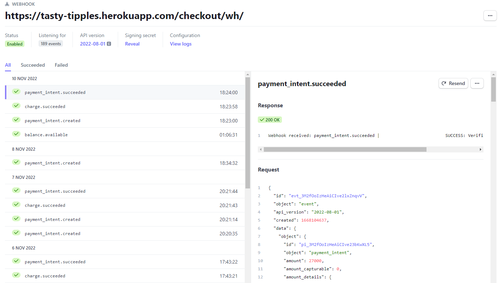

 ## Version Control
  - Git was used as the version control software. Commands such as git add., git status, git commit and git push were used to add, save, stage and push the code to the GitHub repository.

## Cloning

1. On [GitHub](www.github.com), navigate to the main page of the repository.  [Click Here for Repository Link](https://github.com/wlillisdev/hiking-hub)

2. Above the list of files, click Code.

3. click Use GitHub CLI, then click the copy icon.

4. Open Git Bash and change the current working directory to the location where you want the cloned directory.

5. Type git clone, and then paste the URL that was copied previously in step 3.

6. Press Enter to create the local clone.

[git cloning steps with pictuers](https://docs.github.com/en/repositories/creating-and-managing-repositories/cloning-a-repository#cloning-a-repository-to-github-desktop)

## Forking

- A fork is a copy of a repository. Forking a repository allows you to freely experiment with changes without affecting the original project.

1. Open GitHub
2. Find the 'Fork' button at the top right of the page
3. Once you click the button the fork will be in your repository


#   Technologies Used

## Languages

  - [HTML5](https://en.wikipedia.org/wiki/HTML5)
    - Markup language used to create webpages of the site. 
  - [CSS](https://en.wikipedia.org/wiki/CSS)
    - CSS is the language we use to style HTML and Bootstrap framework.
  - [Python](https://www.python.org/)
    -  It is used when creating the backend functionality in Django.

## Frameworks

  - [Django](https://www.djangoproject.com/)
    -  Python framework used to create all the backend logic
  - [Bootstrap](https://getbootstrap.com/)
    - CSS framework directed at responsive, mobile-first front-end web development.
  - [Django-allauth](https://django-allauth.readthedocs.io/en/latest/)
    - For authentication, registration, account management

## Databases

  - [SQLite](https://www.sqlite.org/index.html)
    - Database during development 
  - [PostgreSQL](https://www.postgresql.org/)
    - Database used to store all the data on deployment

## Django Packages

  - [gunicorn](https://gunicorn.org/)
    - The Gunicorn "Green Unicorn" is a Python Web Server Gateway Interface HTTP server.
  - [psycopg2](https://pypi.org/project/psycopg2/)
    -  As an adaptor for Python and PostgreSQL databases
  - [Summernote](https://summernote.org/)
    - Simple WYSIWYG Editor
  - [Stripe](https://pypi.org/project/stripe/) 
    - For processing all online and credit card purchases on the website
  - [Pillow](https://pypi.org/project/Pillow/) 
    - To process and save all the images downloaded through the database<br> 
  - [Crispy Forms](https://django-crispy-forms.readthedocs.io/en/latest/)
    - Used to style and manage Django form
  - [Dj_database_url](https://pypi.org/project/dj-database-url/)
    - To parse the database URL from the environment variables in Heroku

  
##  Tools
   - [Balsamiq](https://balsamiq.com/) 
     - Used to create wireframes
   - [Google Fonts](https://fonts.google.com/) 
     - Used to import fonts
   - [TinyPNG](https://tinypng.com/) 
     - Used to compress images
   - [Font Awesome](https://fontawesome.com/) 
     - Used to create the icons on site
   - [LucidCharts](https://www.lucidchart.com/) 
     - Data model design
   - [Coolors](https://coolors.co/) 
     - Used to design color pallet
   - [Heroku](https://heroku.com/) 
     - Used to host the project
   - [Google Developer Tools](https://developer.chrome.com/docs/devtools/) 
     -  used to debug the website and edit styling
   - [GitHub](https://github.com/) 
     -  GitHub is used to store the projects code 
   - [GitPod](https://www.gitpod.io/) 
     -  GitPod was the IDE used to create the site
   - [W3C - HTML](https://validator.w3.org/) 
     -  W3C was used to validate all the HTML code 
   - [W3C - CSS](https://jigsaw.w3.org/css-validator/) 
     -  W3C was used to validate the CSS code
   - [Jshint]https://jshint.com/)
     - Used to validate javascript
   - [Sitemap Generator](www.xml-sitemaps.com) 
     - Used to create sitemap.xml 
   - [Privacy Policy Generator](https://www.privacypolicygenerator.info/)
     - Used to create the site's privacy policy
   - [Mailchimp](https://mailchimp.com/?currency=EUR) 
     - Used to create the newsletter signup functionality.


## Images
  - Images were taken from [Pexels](https://www.pexels.com/)

## Content
  - Content for products and images were taken from  [Irish Drink Shop](https://www.irishdrinkshop.com/)
 
## Credits
   - Reference was made to the [Code Institute](https://codeinstitute.net/ie/) Django Boutique Ado tutorials and modified.
   - [Corey Schafer Django Tutorial](https://www.youtube.com/watch?v=UmljXZIypDc) Very helpful with understanding all elements of setting up a Django blog & for implementing user crud on blog posts.
   - [Codemy Django Blog Series](https://www.youtube.com/watch?v=B40bteAMM_M) Used to understand setting up views, templates & bootstrap.
   - [Net Ninja Django Tutorial series](https://www.youtube.com/watch?v=n-FTlQ7Djqc) recommended by other students in slack, provided a simplified explanation Django’s MVT.
   - [Django Documentation ](https://docs.djangoproject.com/en/4.0/) used to trubleshoot problems and get information.
   - [Bootstrap](https://www.youtube.com/watch?v=4sosXZsdy-s) Tutorials used to understand bootstrap.
   - [Code with Stein Django Tutorials](https://www.youtube.com/watch?v=bAG_Ia8LX-M&list=PLpyspNLjzwBmIDrDOaPkLLuy5YDDNW9SA)
   - [Stripe](https://stripe.com/docs)
  
## Resources
  - [Stack Overflow](https://stackoverflow.com/)
  - [W3Schools](https://www.w3schools.com/)
  - [w3docs](https://www.w3docs.com/)
  - Notes & Videos from course work from [Code Institute](https://codeinstitute.net/ie/)

##  Acknowledgements
 - Special thanks to my mentor <strong>Miguel Martinez</strong> for all his help and guidance in the development of my final project & during my codeing journey. Special thanks to the Code Institute Tutor Support, Kasia and our regular class meetings and members of the awesome slack community.

#  Conclusion
  - I would like to experiment more with Django and build some more ecommerce projects. Overall, I learned a lot and enjoyed working with Django framework.
  - If I was to build this site again, I would spend more time on the wireframes and model designs.
  - If it had time, I would like to have added a Wishlist and related products to the site.   


