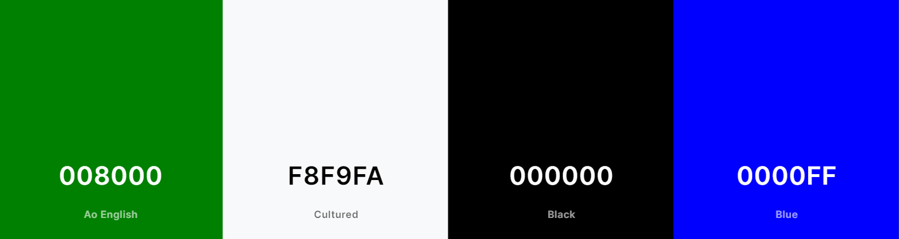
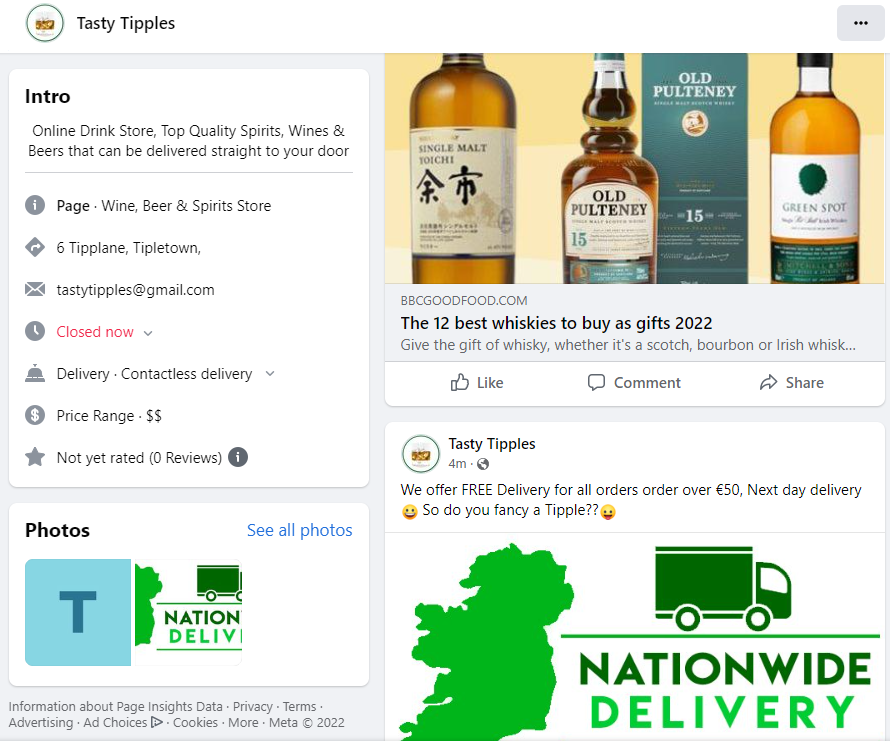
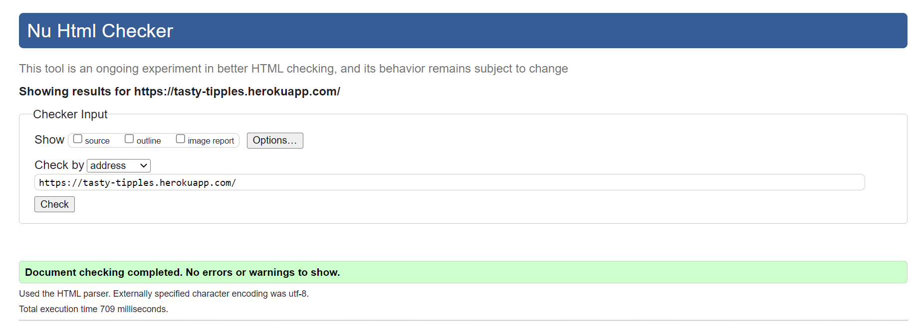

# Tasty Tipples
## Overview
Tasty Tipples in a fictious online drink shop that has a drink for every occasion! It is a full-stack Django website built using Python, JavaScript, HTML and CSS. This is a B2C e-commerce website (Business to Customer).
Customers can purchase a wide variety of high-quality beverages such as Spirits, Wines and Beers and get it delivered straight to their door.
Users are able to subscribe to the newsletter for details of our latest’s drinks deals, secret sales and new products releases.

Tasty Tipples allows the users CRUD functionality when leaving product reviews. The site admin also has full CRUD functionality for product management adding, editing and deleting products. The user can Sign Up / Log In to their user profile, check order history as well as viewing all products and adding items to their bag. The website has full payment functionality through Stripe. Although this is a fictious site the logic and design could be used for any company selling products online.

- You can see the live website [here](https://tasty-tipples.herokuapp.com/)..

# Aim of Website

The goal of this website is to become leading Online Drinks Store in Ireland. To provide a platform so users find and buy products produced in Ireland by Irish Distilleries and Craft Brewers. We also want to be to go to place to get unique Spirits, Wines & Beers that currently cannot be easily got for customers in the Irish Market. This ecommerce platform will also aim to be a hub for educating people about products, distillers, brewers and provide honest reviews so customers can make an informed purchase.

# Target Audience

 The alcohol e-commerce market is expected to surge to over 42 billion by 2025 as outlined in [Forbes](https://www.forbes.com/sites/katedingwall/2021/12/22/alcohol-e-commerce-expected-to-reach-42-billion-by-2025/) recent article. Tasty Tipples is perfectly placed to take advantage of this surging market. Our Target market currently is male and female aged between 25 to 50 located in Ireland. Once the shop is established, we will be aiming our sights on high value clients on the world market with our high-end spirits made in Ireland.

# User Experience (UX)

## User Stories

### First Time Visitors Aims:
  - As a first-time visitor, I want to quickly and easily understand what this website is about and what it can do for me.
  - As a first-time visitor, I want to be able to easily navigate around the site.
  - As a first-time visitor, I want to be able to register and create an account to get full access to the site.
  - As a first-time visitor, I want to quickly view a summary of all products available.
  - As a first-time visitor, I want to click on a product and view the product details.
  - As a first-time visitor, i would like to learn more about the site owners.

### Customer Aims:
  - As a customer, I want to be able to quickly search the site to see if they have the product I am looking for.
  - As a customer, I want to see this is a reputable website and that my payment will be secure.
  - As a customer, I want to be able to enter my payments details to pay for my order.
  - As a customer, I want to be able to add multiple products to a shopping bag a see a total.
  - As a customer, I want to be able to view my shopping bag and be able to edit it before checkout.
  - As a customer, I want to be able to contact the store owner if I have any questions.
  - As a customer, I want to be able to see reviews on products from other customers.
  - As a customer, I would like to get an email confirmation of my order to confirm my order was successful.
 

#### Returning Visitors Aims (registered user):
  - As a returning visitor, I would like to be able to quickly log in and log out of my account.
  - As a returning visitor, I would like to be able to view my profile and my order history.
  - As a returning visitor, I would like to be able to leave a review on the product I purchased.
  - As a returning visitor, I would like to find links to their social media channels and follow them.
  - As a returning visitor, I would like sign up to a newsletter to find out about any special offers or new products.
  - As a returning visitor, I would like to learn & be educated more about products and manufactures from their blog.
 
### Admin / Store Owner Aims:
  - As a store owner, I want to be able to create, edit update or delete a product.
  - As a store owner, I want to be able to login to the admin panel of the site.
  - As a store owner, I want to be able to change user permission on the site and delete users if necessary.
  - As a store owner, I want to be able to add, edit or delete a blog post.
  - As a store owner, I want to be able to delete any inappropriate reviews.
  - As a store owner, I want to be able to view order details from customer’s so I can process orders.
  - As a store owner, I want to be able to market my website online to drive traffic to my site.

   
# Agile Approach to Project Devlopment

An agile approach was taken in the development of this project. The project will be dissected into smaller parts and an iterative approach to project management and development will be used to achieve faster development of the project and optimise time usage.

- MoSoCoW Method:
  - I will also aim to integrate the MoSoCoW Method in to this project. Which is a four-step approach to prioritizing which project requirements need to be carried out first in order to achieve project goals and criteria of user stories. Custom labels will be created in github and allocated to each requirement so they can be easily filtered and identified.
  - 
- User Stories
  - The whole project was broken down in 30 individual user stories, each user story was a self-contained development mini project that helped reach the overall goal of the website. They were enterd into github as github issues.
  - [View List of 30 User Stories](https://github.com/wlillisdev/tasty_tipples/issues?page=1&q=is%3Aissue+is%3Aclosed)
  - Specific acceptance criteria were allocated for each user story and a list of tasks were also established. Each task would need to be completed to ensure acceptance criteria is met. See example below.
  - 
  - The Moscow method was then applied to each user story. And tags were applied to prioritise the order of work.
  - [Example of MOSCOW tags](assets/readme/moscow_tags.png)
  - The user’s stories were then put into Tasty Tipples Iteration 1 for website launch. These usere stories were deemed essential for the initial launch of the website.
  - [View Project Iterations](https://github.com/wlillisdev/tasty_tipples/milestones)
  - A Kanban board was set up in github in order to manage the various project user stories. It was divided into 3 main areas to track the progress of user stories. The 3 Columns were To Do, In Progress, Done.
  -[View Kanban Board](https://github.com/users/wlillisdev/projects/3/views/1)
 
# Features 

 [View Homepage Featuers](https://tasty-tipples.herokuapp.com/)

## Favicon
 - As it is an online drink store, I used a drink related icon. A champagne bottle opening it is eye catching and fun and also ties in with the websites primary color green. The Favicon was got from [favicon.io](https://favicon.io/)
  

## Navigation Bar
 
  - The Navigation bar is located at the top of all Pages. It is simple but clean design. It includes the logo, Main Products Links, search bar,My Account and a Shopping Bag.
  - If a user has logged it, they can view thier profile via the account link.
  - Notifcation Banner, is located on top of the nav and displays important information.
  - It will allow a visitor to quickly and easily get around the site as each link logically leads to the next.
  - The nav elements of the main products has an hover underline transtion effect that is generated when hovered over which adds to the user experience.
  - The nav bar is responsive and collapse’s in to hamburger menu when on smaller screens.   
  - The nav bar below shows user logged in view.
  
  - The responsive nav bar below.
  - 
 
## Landing Page

  - The landing page contains an eye-catching background image of lots of bright bottles of spirits and immediately catches the user’s attention.
  - The text on the screen clearly tells the user what’s the site is about and what the user needs to do next. And they are encouraged to Shop Now.
  - Hero image displayed below
  - 

## Welcome Section

- If the users scroll down from the hero image, looking for more information. They will come across the welcome section.
- It provides the user with a brief statement about who we are and what we can do for the user.
- It also gove the user an oppirtunity to sign up to  our newletter.
- It also gives the site owner the opportunity to optmise the text with important onsite SEO keywords.

- 

## Popular Products

- This section invites the user to click on some of our popular products. It gives the user a brief description of each product to get their attention it also has an eye-catching image. It helps on the user’s journey and allows a easy path to what the user is looking for.
- It also allows the site owner the opportunity to insert important SEO keywords.
- The boxes have a hover effect so when the user hovers over the image the box is raised. It helps with user experience and user retention on site.

- 

## Customer Testimonials

- This section was designed to build confidence with new site visitors,new visitors can see real client Testimonial’s so a potential new customer can have confidence that we are a trusted and reputable ecommernace site.
- The boxes have a hover effect so when the user hovers over the image the box is raised. It help with user experience and usere retention on site.

- 

## Footer

  - The footer is simple and clean design it is the same on all pages of the website.
  - It can be broken down into 4 main columns, social media, Shop, Company Details & newsletter.
  - Social Media column - Contains links to our 4 main social channels, icons have a hover effect. Also, to instil user confidence a link to our trust pilot page is also included.
  - Shop column - Contains links to Login and all our main product category pages.
  - Company Details column - Contains links Blog, About Us, Privacy Policy, Terms of Service and Contact Us page
  - Newsletter column - Contains a form to allow the user to sign up to our newsletter.
  - The main aim of the footer is to increase engagement with visitors and allow easy navigation and links to important information. With the goal of getting the user to subscribe to the social channels & newsletter.

 

## Scroll Back To Top
  - When the user scrolls below the fold on certain pages in the botton right of the screen there i an arrow. When the user clicks on it, the user will be retuned to the top of the screen.And the icon will be hidden. This featuer will improve user experience.
 

## About Us

  - About Us section is a very brief description about Tasty Tipples to quickly give the user more information about the website and why we started the business.
  - It highlights the goals of the Business so the user can understand and build trust with the brand.
  
  - 
  &nbsp;

  - It also provides links to imporatant external resources for anyone suffering with alchol problems.
  &nbsp;

## Contact Us

  - The contact information for Tasty Tipples is visible to the user, including their address, phone number.
  - The user is asked for their contact information and a brief message about their inquiry
  - All fields are required for the message to be sent user will be given feedback if any errors occur.

  - 
  - The user will get an alert if the message was successfully submitted.

  - The site owner can view this inquiry from the adimn page under contact us app.

  - 
  &nbsp;

## All Products Page

  - When the user clicks on all products every product on the site will be displayed on one page. They are displayed in a card format and the layout depends on the device used.
  - The cards have a hover effect that cause the cards to be raised if hooved over.
  - Each card displays information in relation to product name, price, rating and category.
  &nbsp;

  - 
  &nbsp;

  - The user also has the ability to apply various filters to sort product via specific criteria.
  &nbsp;

  

## Product Detail Page

  - This page displays important imformation about the product. It shows Name,Category,Review score and product description on the top part of the card.
  - Product details gives the user more information to the buyer in relation to the producer,size and alchol content.
  - The user has the ability to type in a specific quantity or use the + or - buttons.
  - The user add the product to bag if they would like to buy the product.
  - When the Admin is logged in the edit and delete buttons will only appear to give the admin CRUD capabilities for the product.

  - 
  &nbsp;

## Reviews
- Add Review
  - Only registerd users can add a product review.
  - If user is registerd a form will be visible, they will have the ability to pick a score out 1 to 5 stars. And write a brief review on the product.
  - The edit and delete buttons are only visible on the review to the user profile who created the review.
  - 
  &nbsp;
- Update Review
  - The user has to abilty to update a previous review.
  - 
   &nbsp;
  - 
  &nbsp;
  &nbsp;
- Delete Review
  - The user can also delete a review they have made, when the delete button is pressed a modal pops up and asks are they sure if they want to delete this review.
  - 
  &nbsp;

## Product Management
 
- Add Product
  - The add product page is accessed by the account dropdown menu, under product management. It is only accessible by superusers.

  - 
  &nbsp;
  - The form lists all the  fields that will be required to create a new product.

- Edit Product
  - The Edit product page can only be accessed by superusers.
  - The Edit Product page can be accessed by clicking on the edit button on the product detail page.
  - This page will load all the details of the existing product, giving the admin the option to edit any fields and update the information.

- Delete Product
  - The Delete product page can only be accessed by superusers.
  - The delete Product page can be accessed by clicking on the delete button on the product detail page.
  - When clicked a modal will appear asking if you really want to delete this product.
  - 

## Shopping Bag
- The user can add products to the shopping bag as they are shopping, the shopping bag icon in the nav will give the user a running total of goods in the bag.
- On the shopping bag page the shopper can see what products are currently in the bag, and has the option to edit quantity of products or remove the product.Before they head to the checkout page.
- 

## Checkout
- Here the shopper fills out his or her contact details, delivery address, and card number.
- If the user is signed in and has delivery information saved in thier profile, the delivery details and email address will be automatically filled in.
- A box can also be ticked for new users so all thier delivery details are saved to thier profile.
- 

- The order summary will also appear to the right.

## Payment
- Payment is made via Stripe payments.
- The site can be tested by using the dummy card number 4242 4242 4242 4242 with the expiry date 04/24 and the CVC code 242.
- An image saying secure payments was added with an exteral link to stripe if customers want to check it out.
- 
- A loading spinner page appears and if payment is succesfull you will be redirected to a Thank You page, With details of your order and alert saying order successfully processed.
- 

## Confirmation Email
- If the order is successfull a confirmation email will be sent to customer.

- 

## Webhooks
- Using the Stripe settings, webhooks have been set up to confirm an order goes through after payment.
- 

## Profile Page
- When a User registers for a new account, a profile page will automatically be created for them. The link to their profile page appears in Account in the navigation bar once they are logged in. On this page the user can choose to update their profile information 
- The Profile page also contains a table listing out the details of all the users past purachses. 
- The user can update information on their profile if they require.
- 

## Register, Sign In & Log Out of Account
- Sign Up
  - When a new user clicks on register they will be brought to the sign up page.
  - After submitting the form,  The User are then emailed a verification link to confirm thier details and finalise the set up the useres account.
  - 

- Sign In
  - The login page is used to log in users with an existing account.
  - A Forgot Password link is also present that allows users to recover their password if required.
  - 

- Log Out
  - The logout page allows the user to sign out if they are signed into an account
  - It also displays the useres name
  - 
  
## Error Pages
- Custom error pages were created and set up,
 - Error Pages Created
    - 400 Bad Request  
    - 403 Page Forbidden 
    - 404 Page Not Found 
    - 500 Server Error 

## Newsletter
- Mail Chimp has been intergrated into this site via the newletter sign up form in the footer. Mail chimp will allow us the effectly collect useres emails and run email marketing campaigns.
- Users will get feed back if thier email was succesfully submitted.
- 
- Mail Chimp interface shows how many subscripers we currently have from the form.
- 

## Message and Alerts to site Users
- In the top right-hand corner of the screen a box will pop up informing the user of any actions they have performed.
- Diffrent alerts will have diffrent colors for example a success alert is green and and an error alert is red.
- 
- 

## Blog
- Tasty Tipples has a blog for content marketing, The inital page has a list of blog posts, that contantains a Title and a snippet of what the article is about. 
- The blog posts will be paginated after 3 posts. Paginated pages can be found at the bottom blog post list..
- Once the user clicks on a blog post to read, they will be brought to a blog detail page. This will contain all the articles information.
- Currently blog posts can only be added from the admin panel. Summer note has also been set up to format blog post.

## Admin Panel
- On the Admin Panel and as an admin/superuser they have full CRUD functionality.For all apps on the admin apanel.
- They can also quickly view and inspect recent orders.
- 

# Design
 - Theme
   - The Theme of the website was to build a bright and engaging ecommereance site. The styling was kept to the minimum as we dident want to take away from the product images. And wanted the customer to focous 100% on the products.
   - Fonts were imported from google fonts, Pacifico for the logo & Lato were chosen gor general text. These were picked as they were bold, simple and easy to read.

 - Data Model
   - Lucid Charts was used to design and visualise the models used in this project.

   
    - FK refers to Foreign Key

 - Color Palette
   - The colour palette is made up of Three main colours. Although simple they create a good contrast with each other and helps support the overall theme. The Blue was used mainly for buttons and the green for a hover effects on buttons.

 

- Imagery
   - The images that were selected for the website were bold and bright and conveyed fun and enjoyment. products were kept with white backround where possible to highlight them more.

- Wireframes
   - To create the initial layout and wireframe I used Balsamiq. This helped fine tune the design and layout. It also helped in calculating the amount of content and images required. (Home Page Below)

  - 
  - [Display Posts Wireframe Concept](static/readme/posts_page_layout.png)
  - [Post Detail Wireframe Concept](static/readme/post_detail_wireframe.png)
   
# Future Development

- Wish List
  - The user will be able to select products they like and add them to a wish that will be stored in thier profile page.
 
- Blog 
  - When i have time add full CRUD capabilities to the blog from the front end for the admin.And add comments section to the blog.
 
- Sign Up & Log In with Socail Media
  - Allow the user to quickly register an account or log in via a socail media profile.

- Age Verification
  - A modal to pop up on the home screen so the user needs to verify age before they can enter the site.

# Web Marketing

## Target Audiecne
 Our Target market currently is male and female aged between 25 to 50 located in Ireland. Once the shop is established, we will be aiming our sights on high value clients on the world market with our high-end spirits made in Ireland

## Socail Media
- Facebook,Instagram,Youtube,Tiktok
  - Our social channels is how we aim to build our brand awareness and drive organic traffic initally to our website.
  - We will aim to create short snappy fun video content and leverage the growning trends of Tiktok,Youtube Shorts & reels to grown our followers and drive traffic quickly. With the aim of getting our content to go viral.

### Facebook Page

[Visit Facebook page](https://www.facebook.com/profile.php?id=100087413854348)

## SEO (Search Engine Optimisation)
- Keyword Research
  - A number of tools were used to complile a list of keywords and analyse keywords to see the search volume, the competivteness & buyers intent.
  - [Googles Keyword planner](assets/readme/google_planner_ireland.png)
  - [Wordtracker.com](assets/readme/whiskey_keywords.png)
  - [And the related searchs section at the bottom of a google search page](assets/readme/related_searches.png)
  - A list of keywords were seleceted to represent the  buyers journey. A mixtuer of long tail and short tail Keywords with low to high keyword competivtness were picked.
  - 
  - Onsite SEO will be carried out to optomise product pages & alt tags. Due to time constraints it will not be completed in this iteration of the project.
  - Long term off site SEO link building campaigns will also be used to grow organic search traffic. This will be completed futuer iterations of the project.

## Content Marketing

- The Tipple Blog
  - Our blog will be used to target SEO keywords and answer questions that people are actively searching for answers online. This will not only educate our shoppers but it also help build confidence and trust in our brand. While at the same time ranking the website in search results for more keywords.

- Short Form Content 
  - With a huge shift on all social channels to short form video content we sill actively release short videos on a daily basis to leverage this trends. Software like [repurpose.io](https://repurpose.io/) will be used to post content across all channels at the same time to reduce time and get maximum exposure.

## Paid
- As this is a brand new website it will take time to generate organic traffic from search engines. So will for the first 6 months be activly be using and testing paid ads to drive traffic and conversions.
- Google PPC
  - We will actively run google ads especially targeting our high ticket products.
- Facebook,Tiktok,Youtube
  - We will run ad campaigns on these channels mainly focused on brand awreness and builing an online presence. We wont direcly market drink products on these channels. But adopt a playful and fun approach to enagae with users.

## Email Marketing
- Email marketing when done correctly has low input costs and allows us to target our customers with a more customised offering giveing a Better ROI.
- Mail Chimp
  - We will initally build a subscriber list to our newletter via the form in the footer of our website.
  - We will send weekly newsletters of our latests drinks deals, secret sales and new products releases.

## Outsourcing
- The intention is to outsource all paid marketing to an digital agency & also get them to monitor and update our keywords for SEO on a perodic basis.The agency will also take care of the email marketing campaigns. The rest will be done inshouse by the staff of Tasty Tipples.

## Sitemap.xml
- A sitemap file with a list of all thr important URLs was created to allow  search engines to quickly crawl the website and index its pages. This was made using XML-sitemaps.com. This will can then be submitted to google search console and bing webmaster tools.

## Robots.txt
- A robots.txt file was created to tell search engines the website pages not to vist or index.

# Testing

### Validator Testing 

 - HTML Validator
   - [W3C](https://validator.w3.org/) site was used to validate the **HTML** code.
   - A number of small errors were initially flagged up.
     - [Erros From Validator Hompage](static/readme/error_html.png)
     
 ### All Pages are now error free see links below:

 
   - [Link to Homepage Test Passed](https://validator.w3.org/nu/?doc=https%3A%2F%2Ftasty-tipples.herokuapp.com%2F)
   - [Link to About Us Test Passed](https://validator.w3.org/nu/?doc=https%3A%2F%2Fhikinghub.herokuapp.com%2Fabout%2F)
  

## CSS Validator
  - The [W3C](https://validator.w3.org/) was used to validate the **CSS** code
  - The website had a few [errors](assets/readme/css_errors_1.png) initally but were fixed.
  - The website passed with no errors

  

  ## Python
  - Python files such as views.py, models.py ect. were run through  [Pep 8 ](http://pep8online.com/)validator and no errors found.
  - [some erros found during testing](static/readme/erros_views_py.png)
  - The Following python files passed testing with pep 8 
  
  - [view passed urls.py](static/readme/urls.py_pass.png)
  - [view passed models.py](static/readme/models.py_pass.png)
  - [view passed forms.py](static/readme/forms.py_pass.png)
  - [view passed apps.py](static/readme/app.py_pass.png)
  - [view passed admin.py](static/readme/admin.py_pass.png)

  ## Java Script
  - [some erros found during testing](static/readme/js_error.png)
  - I found a solution on stack overflow for the  esversion: 6 error
  - [view passed js](static/readme/js_pass.png)
  

 
## Lighthouse
 - Lighthouse testing was carried out in Developer Tools in Chrome. Initially it gave a number of improvements and flagged up a number of images that needed to be reduced in size. Which was done.
 - [See Light House Before Improvements] (static/readme/lighthouse_before.png)
 - The results were also skewed as the chrome extensions on my testing device was affecting the lighthouse results. The tests were redone in incognito window and performance score increased. Results below from home page
 - Desktop Result’s
 
 - [Mobile Light House Results](static/readme/mobile_lighthouse.png)

 
## Manual Testing
  - All the site links were manually tested to see if they all worked ok and linked to the correct locations.
  - The site was further tested using feedback from mentor, family and friends who checked it on different devices they had.
  - All of the page's features were tested on Google Chrome, Microsoft Edge, Mozilla Firefox, Safari, and Opera.
  - Google Chrome's Developer Tool was used to inspect page elements during the build and helped identify and debug issues within the HTML and CSS.
  - The README.md was checked before final submission and links verified.

  ## Manual Feature Testing
  - A structured approach was taken to go through all of the sites  features to see it they worked properly. 
  
  | Feature Tested | Testing Method | Final Result |  
| --- | --- | --- |
| User Register account |- Each mandatory fields were left blank intentionally to check if error messages appeared if form submitted blank | Pass | 
| User Register account - Invalid Email Field | - An invalid email address was tested to ensure error message appeared | Pass | 
| User login to account - Blank Fields | - All fields were left blank to ensure an error message was displayed to the user | Pass |
| User login to account - wrong password | - Incorrect user password was intentionally used with wrong spelling and upper and lower case letters and numbers were tested to ensure an error message was displayed to the user | Pass |
| User logged in to account - name displayed in navbar and homepage | - Logged into account with registered user account to see if name displayed in navbar and welcome message  |  Pass |   
| Non registered user - can not add a blog post | - As a not registered user their is not option in nav bar or other pages for user to add a blog post |  Pass |
| Non registered user - can not like or comment on posts| - As a not registered user their is no option to add a blog comment to post. when the heart is clicked on it dose not activate and dose not add a like  |  Pass | 
| User Logged In - User name appears in nav & welcome message| - Logged in a register account. User name appeared in nav bar and also in welcome message on home page|  Pass |
| User Logged In - Add a blog Post in Nav Bar| - Logged in . Add a blog post option appears in the nav bar|  Pass |       
| Create a blog post -  Fields left blank | - This was tested with multiple times with one field being left blank each time. Pass criteria is that alert appears to prevent successful posting until all fields have been completed|  Pass | 
| Create a blog post -  No Featured Image | - Blog post was added with no featured image from user. A  placeholder image was added by default|  Pass |
| Create a blog post -  Unique Title | - A blog post with the same title as an existing post was created, error message displayed appeared saying unique title required |  Pass | 
| Update a blog post -  you are not the author | - If you are not the author of a blog post update button will be hidden from the user a 403 error will occur if /update typed into url |  Pass |
| Update a blog post -  you are the author | - If you are  the author of a blog post update button will be visible to the author |  Pass 
| Update a blog post -  prepopulated fields from blog post | - clicked on update button, update blog post form all the fields were populated from previous blog post |  Pass
| Update a blog post -  update fields on form | - All fields on the prepopulated form were updated and submitted and the blog post content was successfully updated |  Pass
| delete a blog post - you are not the author | - If you are not the author of a blog post the delete button will be hidden to the user and 403 error will occur if /delete is typed into url | Pass          
| delete a blog post - you are the author | - If you are the author of a blog post delete buttons will be visible to the author, on delete the post is successfully removed from website | Pass
| Alert message - sign in | Alert to confirm user has successfully signed in appears on top of screen. | Pass |  
| Alert message - sign out | Alert requests user to confirm they want to log out before logging out of site, and alert appears you have successfully signed out | Pass |  
| Alert message - Add Comment | Alert your comment was successfully added appears on top of screen | Pass |
| Alert message - Add blog post | Alert your blog post was successfully added appears on top of screen | Pass | 
| Alert message - Update blog post | Alert your blog post was successfully updated appears on top of screen | Pass |
| Admin - restricted access | - Only the admin/superuser account can log into the admin view panel. | Pass |
| Admin Panel - CRUD in the admin panel| - Admin has capability to create, update and delete blog posts, approve and delete comments | Pass |
| Error Alerts - custom error pages| - The Urls were manipulated to test 403,404, & 500 errors, all errors delivered a unique error page | Pass |

## User Sory / Issue Testing
  - All the issues previously created in git hub at the start of the project were checked to see if the acceptance criteria were met in the final project delivery of this iteration.

  | Issue | User Story | Acceptance Criteria | Result |  
| --- | --- | --- | --- |
| [1](https://github.com/wlillisdev/tasty_tipples/issues/1) | As a User I can sign up for a new user account so that I can have complete functionality of the whole store. |  A sign-up link is clearly shown in the nav bar, The user can easily enter all required details in form, name, email, password,form won't submit if it is not filled out correctly| Pass |
| [2](https://github.com/wlillisdev/tasty_tipples/issues/2) |  As a returning User I can quickly log in to my account so that i can vire my profile, history of past orders, or leave a review | Login displayed in nav bar so user can quickly access the login page | Pass |
| 3 | As an Admin I can **view, create, edit, update and delete all blog posts ** so that the Admin can easily moderate and control the website's content. | Admin can delete posts, Admin can edit posts, Admin can filter posts, Admin can search posts | Pass |
| 4 | As an admin I can create draft posts so that I can finish writing and editing blog posts later | Admin can create a draft blog post in admin panel | Pass |   
| 5 | As a user I can view a list of trails blog posts so that I can see easily move through the list of trails and pick one I want to read | Trails appear in the paginated list | Pass |   
| 6 | As a user I can see the location of the trail on google maps so that ** i can find out the exact location of the trail to visit there** | User can add click on Google Maps and get directions to the location of the trail. | not included | 
| 7 | As a user I can create a blog post about a trail I have done so that other users can view them | User can create a detailed blog post about a trail they have walked so other users can review and comment on it. User has to be registered in order to create a blog post | Pass | 
| 8 | As a user I can delete blog posts I have created so that I can remove any unwanted trail posts I have made | User can delete blog posts they have created from the website. User can only delete their own content linked to their registered account. | Pass |
| 9 | As a user I can edit my trail blog post so that I can update or make changes to my post | User can make edits and updates to a previously published blog post, User can only their own content | Pass |  
| 10 | As a user I can I can click on a blog post so that I can read the full detailed blog post | User can click on the paginated blog post list and read the full detailed blog post | Pass |
| 11 | As a user I can comment on trial posts so that I can give my feedback & opinion to other users |  User can make a comment on the blog post. User only can only make a comment if they are a registered user. | Pass |
| 12 | As a user or admin I can read comments on a post so that I can read other user's feedback and opinions | Admin can read comments on a blog post. User can read comments on a blog post | Pass |
| 13 | As a user I can view the number of likes on a blog post so that I can see which is the most popular hiking trail |  user can view the total number of likes given to an individual blog post | Pass |
| 14 | As an admin I can **approve or disapprove comments made ** so that I can filter out inappropriate comments |  admin can moderate and quickly filter comments and easily approve and delete comments in the admin panel of the blog | Pass |
| 15 | As a user I can understand the website's purpose quickly so that I know if it’s what I'm looking for |   User can quickly understand website's purpose and what to do next from the homepage of the website | Pass |
| 16 | As a user I can register an account with a social network so that **I can quickly register my account ** |   User can register an account using their Google/Facebook account info | not included |
| 17 | As a user I can get links to important information related to hiking so that so I can get important information related to the hill walking & safety |   user can access important information in relation to hillwalking | not included |
| 18 | As a user I can buy hiking equipment from the website so that ** I can be prepared for my next hike based on user's comments & recommendations** |   user can buy hiking related equipment and clothing from the website | not included |

  
# Fixed Bugs

  - After running the site through HTML checker, a number of small bugs were identified. Each error was identified and an appropriate solution applied, i went through all pages and fixed any errors. It was good lesson and practice in finding problems with code and fixing them.
  - After Running all the pages through lighthouse, it identified issues with a number of images due to size. Lighthouse suggested to change some larger images which was done.
  - After running all python code through pep 8 validator a number of errors were identified and fixed. 
  - When creating the add post form I didn’t want the slug to appear on the form but when removed  it broke the form. I research this problem and found a solution on stack overflow which fixed this problem. [Slugify](https://learndjango.com/tutorials/django-slug-tutorial)
  - On the display posts page unless the images were sized correctly at upload the post cards were out of alignment [Card Alignment issue] (static/readme/card_size_issue.png) and did not look great, I found a solution on how to size the images all the same on stack overflow [Cards images all the same size](https://stackoverflow.com/questions/37287153/how-to-get-images-in-bootstraps-card-to-be-the-same-height-width)
  - The summer note WYSIWYG Editor on the add post form and the update posts form was not responsive and was huge, i did some research on this and found a solution on Github [Summer Note Github](https://github.com/summernote/django-summernote) I was able to customise the summer note WYSIWYG editor and get it to fit and be responsive.
  - There was a bug in the footer it wasent staying on the bottom of the page [Footer Issue](static/readme/fotter_bug.png). I found a solution on stack overflow that fixed this issue.

  # Unfixed Bugs
  - When the user deletes a blog post i can not get the alert message to appear on top of the screen.

  # Security
  - Cross-Site Request Forgery (CSRF) tokens were used on all forms.
  - Secret access keys were stored safely in env.py this was set up before the first push to Github.
  - Django allauth combined with Django’s LoginRequiredMixin and UserPassesTestMixin were used to ensure only signed in users can edit or detele post.

# GDPR (General Data Protection Regulation)
- Tasty Tipples has a Privacy Policy that users can access from the footer. The purpose of this privacy policy is to inform users about how their data is being collected and used.
- This website does use cookies to collect data so dose not require the user to accecpt or reject cookies.
- View [Privacy Policy](https://tasty-tipples.herokuapp.com/privacy/)

# Deployment

The site was deployed via Heroku.
1.  Firstly Log in to Heroku.
2.  Then, click New from the dashboard in the top right corner and from the drop-down menu select Create New App.  Create a unique app name.
3.  Next, select your region. Europe.
4.  Click on the Create App button.
5.  Go to Resources tab and add a Heroku Postgres database.
6.  The next page you will see is the project’s Deploy Tab. Click on the Settings Tab and scroll down to Config Vars and enter the following:
    *   CLOUDINARY_URL = your cloudinary key 
    *   DATABASE_URL = the url of your heroku postgres database
    *   SECRET_KEY = a secret key for your app.
    *   PORT = 8000
    *   DISABLE_COLLECTSTATIC = 1 during development only

7.  Go to the top of the page and now choose the Deploy tab.
8.  Select Github as the deployment method.
9.  Confirm you want to connect to GitHub.
10. Search for your repository name and click the connect button.
11. Scroll to the bottom of the deploy page and select deployment type:
12. Click either Enable Automatic Deploys for automatic deployment when you push updates to Github.
13. Select the correct branch for deployment from the drop-down menu and click Deploy Branch for manual deployment.
14. Click on open app to view deployed site.

**** Ensure in Django settings, DEBUG is False & DISABLE_COLLECTSTATIC is removed from config var for final deployment, create a Procfile and save database and cloudinary urls and secret key to env.py.

 ## Version Control
  - Git was used as the version control software. Commands such as git add ., git status, git commit and git push were used to add, save, stage and push the code to the GitHub repository.

## Cloning

1. On [GitHub](www.github.com), navigate to the main page of the repository.  [Click Here for Reposititory Link](https://github.com/wlillisdev/hiking-hub)

2. Above the list of files, click Code.

3. click Use GitHub CLI, then click the copy icon.

4. Open Git Bash and change the current working directory to the location where you want the cloned directory.

5. Type git clone, and then paste the URL that was copied previously  in step 3.

6. Press Enter to create the local clone.

[git cloning steps with pictuers](https://docs.github.com/en/repositories/creating-and-managing-repositories/cloning-a-repository#cloning-a-repository-to-github-desktop)

## Forking

- A fork is a copy of a repository. Forking a repository allows you to freely experiment with changes without affecting the original project.

1. Open GitHub
2. Find the 'Fork' button at the top right of the page
3. Once you click the button the fork will be in your repository

# Technologies Used

## Languages

  - [HTML5](https://en.wikipedia.org/wiki/HTML5)
    - Markup language used to create webpages of the site. 
  - [CSS](https://en.wikipedia.org/wiki/CSS)
    - CSS is the language we use to style HTML and Bootstrap framework.
  - [Python](https://www.python.org/)
    -  It is used when creating the backend functionality in Django.

## Frameworks

  - [Django](https://www.djangoproject.com/)
    -  Python framework used to create all the backend logic
  - [Bootstrap](https://getbootstrap.com/)
    - CSS framework directed at responsive, mobile-first front-end web development.
  - [Django-allauth](https://django-allauth.readthedocs.io/en/latest/)
    - For authentication, registration, account management

## Databases

  - [SQLite](https://www.sqlite.org/index.html)
    - Database during development 
  - [PostgreSQL](https://www.postgresql.org/)
    - Database used to store all the data on deployment

## Django Packages

  - [gunicorn](https://gunicorn.org/)
    - The Gunicorn "Green Unicorn" is a Python Web Server Gateway Interface HTTP server.
  - [psycopg2](https://pypi.org/project/psycopg2/)
    -  As an adaptor for Python and PostgreSQL databases
  - [Summernote](https://summernote.org/)
    - Simple WYSIWYG Editor 
  - [Cloudinary](https://cloudinary.com/)
    - The image hosting service used to upload images
  - [Crispy Forms](https://django-crispy-forms.readthedocs.io/en/latest/)
    - Used to style and manage Django forms
  
## Tools
   - [Balsamiq](https://balsamiq.com/) 
     - Used to create wireframes
   - [Google Fonts](https://fonts.google.com/) 
     - Used to import fonts
   - [TinyPNG](https://tinypng.com/) 
     - Used to compress images
   - [Font Awesome](https://fontawesome.com/) 
     - Used to create the icons on site
   - [LucidCharts](https://www.lucidchart.com/) 
     - Data model design
   - [Coolors](https://coolors.co/) 
     - Used to design color pallet
   - [Heroku](https://heroku.com/) 
     - Used to host the project
   - [Google Developer Tools](https://developer.chrome.com/docs/devtools/) 
     -  used to debug the website and edit styling
   - [GitHub](https://github.com/) 
     -  GitHub is used to store the projects code 
   - [GitPod](https://www.gitpod.io/) 
     -  GitPod was the IDE used to create the site
   - [PEP8](http://pep8online.com/) 
     -  Used to validate and check Python code
   - [W3C - HTML](https://validator.w3.org/) 
     -  W3C was used to validate all the HTML code 
   - [W3C - CSS](https://jigsaw.w3.org/css-validator/) 
     -  W3C was used to validate the CSS code

## Images
  - All images were taken from [Pexels](https://www.pexels.com/)

## Content
  - Content & maps from All Trails was used to generate blog posts  [AllTrails](https://www.alltrails.com/ireland)
 
## Credits
   - Reference was made to the [Code Institute](https://codeinstitute.net/ie/) Django Codestar tutorials and modified.
   - [Corey Schafer Django Tutorial](https://www.youtube.com/watch?v=UmljXZIypDc) Very helpful with understanding all elements of setting up a django blog & for implementing user crud on blog posts.
   - [Codemy Django Blog Series](https://www.youtube.com/watch?v=B40bteAMM_M) Used to understand setting up views,templates & bootstrap.
   - [Net Ninja Django Tutorial series](https://www.youtube.com/watch?v=n-FTlQ7Djqc) recommended by other students in slack, provided a simplified explanation Djangos MVT.
   - [Parallax Scrolling Effect](https://www.w3schools.com/howto/howto_css_parallax.asp) used to create the effect on the homepage.
   - [Django Documentation ](https://docs.djangoproject.com/en/4.0/) used to trubleshoot problems and get information.
   - [Create Favicon](https://gauger.io/fonticon/) created favicon from font awsome icon found on stack overflow.
   - [GT Coding](https://www.youtube.com/watch?v=SJVCvnKM_lI) creates a icon that will scroll to top of page when clicked
   - [Django Slug Tutorial](https://learndjango.com/tutorials/django-slug-tutorial) creating slugs in django
   - [Bootstrap](https://www.youtube.com/watch?v=4sosXZsdy-s) Tutorials used to understand bootstrap.

  
## Resources
  - [Stack Overflow](https://stackoverflow.com/)
  - [W3Schools](https://www.w3schools.com/)
  - [w3docs](https://www.w3docs.com/)
  - Notes & Videos from course work from [Code Institute](https://codeinstitute.net/ie/)

## Acknowledgements
 - Special thanks to my mentor Miguel Martinez
 for his help and guidance in the development of my final project. Special thanks to the Code Institute Tutor Support, Kasia and our regular class meetings and members of the awesome slack community.

# Conclusion
  - I would like to experiment more with Django and build some more projects. Overall, I learned a lot and enjoyed working with Django framework.
  - If I was to build this site again, I would spend more time on the wireframes and model designs.
  - If it had time, I would like to add user profiles and hike categories.   
  - I would also learn to make more commits during the project built.

